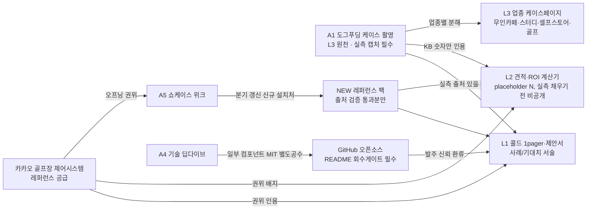
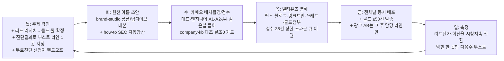
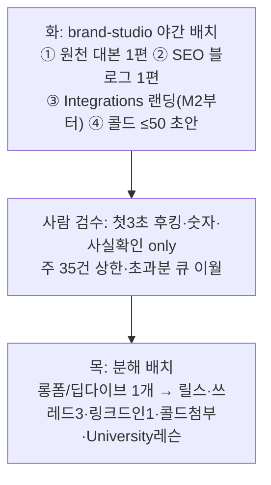
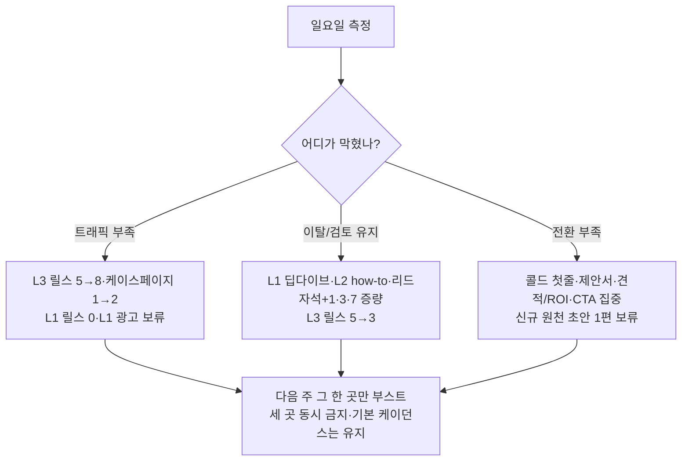
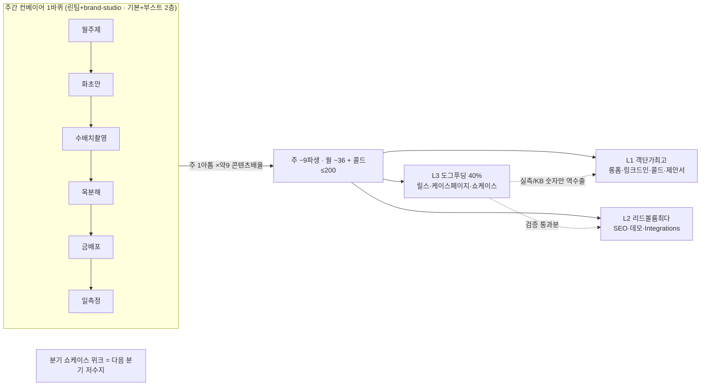

# 오픈아이오티 3라인 마케팅 스케줄 & 원소스 멀티유즈(OSMU) 엔진 — 최종 실행 문서

> 작성: 콘텐츠 운영 디렉터 → 마케팅 책임자 보고용 · 오늘 2026-06-14(일) 기준
> 롤아웃: 2026-06-15(월) 시작 → 13주(약 90일) → 2026-09-13 종료
> 본 문서는 어드버서리얼 감사 10개 이슈를 본문에 반영한 v2 실행본이다. 무엇을 고쳤는지는 맨 끝 §8 참조.

---

## 0. 전제 (팀·기존 문서 관계·오늘 기준·우선순위)

### 0-1. 이 문서가 무엇을 대체하나
- 기존 30일 캘린더(2026-06-08~07-05)를 **업그레이드·대체**한다. 11개사 벤치마크 플레이(채널톡·식스샵·토스·Stripe·Vercel·Supabase·Zapier·자청·Webflow·HashiCorp·아임웹)를 통합한 13주 버전.
- 기존 30일의 **실제** 누적 산출(원문 `오픈아이오티_콘텐츠캘린더_30일.md` "30일 누적 산출" 표 기준): **릴스 16 / 롱폼 4 / 국문블로그 6 / 영문블로그 2 / 링크드인 4 / 쓰레드 8 / 콜드 200(4배치) / 검색광고 상시 / 오토 인스타광고 저예산.** 이 문서는 이 목표를 **충족하고 약간 상회**하며, 상회분은 에버그린으로 비축한다(과생산 정상화 금지 — §1-5 산수에서 정직하게 역산).

### 0-2. 팀 전제 — 린 팀, 진짜 제약은 마케터가 아니라 대표·엔지니어 시간
| 역할 | 인원 | 담당 | 주간 용량 상한 |
|---|---|---|---|
| 마케터 | 1~2명 | 첫3초 후킹 · 숫자 · 사실확인 검수 | **검수 가능 자산 = 주 35건** (릴스 1편 5분 · 콜드 1건 2분 · 블로그/PDF 1건 10분 환산, 마케터 1명 주 20시간 가용 기준). 초과분은 자동 큐로 다음 주 이월 |
| brand-studio (AI) | 직원 0명 | 롱폼/딥다이브/블로그/PDF/제안서 **초안만** 양산 | 무제한(초안) — 단, 사람 검수 상한이 실제 병목 |
| 대표·리드엔지니어 | 카메오 | 촬영·기술 사실확인·출연 | **월 4회 상한** (A2 2 + A4 2). 촬영은 월 1~2회 배치로 몰아 처리 |
| 전담 영업 | 1명 | 클로징(콜드 회신 → 미팅 → 계약) | **주 미팅 8슬롯 상한.** 회신이 캐파 초과 시 콜드 발송량을 줄인다(역방향 제어, §10) |

핵심: **주간 컨베이어 1바퀴**(월 주제 → 화 원천초안 → 수 검수/촬영 → 목 멀티유즈 분해 → 금 배포 → 일 측정). 단, 매주 3라인 풀가동이 아니라 **기본 케이던스(축소판) + 진단 부스트 1곳**의 2층 구조(§2-4·§6-2).

> **"직원 0명"은 과장이라 폐기.** 정확한 표현: **"초안 0명(AI), 검수·출연·사실확인은 사람 필수."** 이 정정이 아래 용량 착시를 없앤다.

### 0-3. 우선순위 원칙
1. **단기현금 6개월.** 매출 3분해의 통제 레버 = '우리를 아는 의사결정자 수'.
2. **비중**: openIoT(L1 풀커스텀 + L2 기성+SW) 약 **60%** / 오토플레이스(L3 도그푸딩) 약 **40%**.
3. **진단규칙**: 막힌 한 곳(트래픽/이탈/전환)만 그 주에 집중. **세 곳 동시 금지.** 그리고 스케줄이 이 규칙을 실제로 따르도록 **풀가동이 아닌 기본+부스트 2층 구조**로 짠다(§2-4).
4. **0~30일 최단 승부**: 신규 제작이 아니라 '이미 있는 자산을 콘텐츠로 전환'. M1 W1~W2는 **신규 도구 0건**(계산기·시퀀스·슬라이드 라이브러리는 M2로 이동, §7). 즉시 현금화 자산: 05 골프장 롱폼·06 콜드 4종·카카오 1-pager·cloud 기존 콘솔 화면.

### 0-4. 3라인 한눈에
| 라인 | 정체성 | 단기현금 순위 | 막힌 곳 진단 | 주력 채널(매트릭스 준수) |
|---|---|---|---|---|
| **L1 풀커스텀** | 칩·펌웨어~앱·클라우드 직접제작 · 객단가 최고 | **1순위** | 정보비대칭(발주 전 실력 검증 불가) | 유튜브 기술 롱폼·링크드인·케이스 PDF·콜드 (**릴스 비주력**) |
| **L2 기성+SW** | SmartThings·헤이홈·Matter 위 앱/웹만 · 리드볼륨 최다 | 즉시수요 | 검색 길목 장악 + 첫주 이탈 | 검색 SEO·검색광고·셀프서브 데모 (**릴스 보조**) |
| **L3 도그푸딩** | '우리 플랫폼으로 우리가 무인매장 10곳+ 운영' 메타증명 | 신뢰 복리 엔진 | 표본 노출(트래픽) | **릴스/쇼츠·인스타·케이스페이지(오가닉 SEO)** |

---

## 1. OSMU 엔진 — 하나로 열다섯 우려먹기

### 1-1. 7개 킹 아톰
| 아톰 | 제작비 | 케이던스 | 라인 | 한 줄 |
|---|---|---|---|---|
| **A1 케이스 촬영 1회** | high | **월 1회 고정** | L3→전라인 | 무인매장 1곳 하루 촬영(워킹스루·**실측 캡처**·시연10컷·B-roll·사운드바이트). 재활용 배율 최고 킹 아톰 |
| **A2 대표/엔지니어 롱폼** | high | **월 2회**(카메오 상한 내) | L1 | 정보비대칭 공격형 10~20분(외주 당하는 5가지·견적 위험·풀커스텀 비싼 이유) |
| **A3 cloud 셀프서브 데모** | medium | **분기 1회 재촬영**(사이 +30일 후킹 교체 리포스트) | L2 | '칩 꽂으니 3분 만에 앱·대시보드' 화면녹화 |
| **A4 기술 딥다이브** | medium | **월 2회**(엔지니어 음성메모 15분→AI 확장→엔지니어 팩트체크) | L1 | ESP32 양산 펌웨어·OTA 벽돌·BLE/MQTT/Matter, 국·영문 동시 |
| **A5 분기 쇼케이스 위크** | high | 분기 1회(5일) | L3→전라인 | Launch Week 역공학, 5일 매일 1건 출시/신규설치처 공개 |
| **A6 무료 PDF 리드자석** | medium | **분기 1회 공통 1종**(라인별은 표지·CTA만 교체) | 공통 | 선택 프레임워크 백서 + 다운로드 게이트(이메일 회수) |
| **A7 AI 제안서 + 콜드 배치** | medium | **주 ≤50건**(리서치 완료 리드 풀에 종속, 풀 마르면 자동 감소) | L1+L2 | 상황 타깃 개인화 콜드, 06 템플릿 변수 전건 치환·체크리스트 6항 통과 |

### 1-2. 아톰 → 파생 표 (정직 배율 — 콘텐츠 파생만 카운트)
> **원칙(이슈4 반영)**: 배율에는 **'한 소스에서 자동 분해되는 콘텐츠 파생'만** 포함한다. 계산기·GitHub SDK·제안서 슬라이드 라이브러리 등 **별도 개발 공수**는 배율에서 제외하고 §1-6 개발 백로그로 분리한다. 릴스는 매트릭스대로 L3 중심(L1=0~2, L2=1~2 데모클립만).

| 아톰 | 릴스/쇼츠 | 롱폼 | 블로그 | 링크드인 | 쓰레드 | 광고 | 케이스/콜드첨부/University | 콘텐츠 배율 |
|---|---|---|---|---|---|---|---|---|
| **A1** | 5(L3) | 1 | 1(케이스해설) | — | 3 | 3 | 케이스페이지1 + 1pager발췌1 | **약 14** |
| **A2** | 0~1(링크드인 네이티브) | (원천) | 1(국문) | 1 | 3 | — | 콜드첨부1 + University1 | **약 7** |
| **A3** | 1~2(데모클립) | — | 1(how-to) | — | — | 광고랜딩1 | 콜드링크1 + University1 | **약 6** |
| **A4** | — | (영상소스) | 2(국+영) | 1 | 3 | — | 콜드첨부1 + University1 | **약 8** |
| **A5** | 10+ | 발표5 | — | — | — | 광고묶음 | 케이스5 + 뉴스레터1 | **분기 폭격** |
| **A6** | — | — | 3(발췌) | — | 3 | 3 | 랜딩1 + 콜드/제안서첨부1 | **약 11** |
| **A7** | — | — | FAQ글1 | — | 1 | 헤드라인 | 콜드 ≤50건 | **별산(콜드)** |

콘텐츠 파생 평균 **약 9배**(콜드는 별산). 초안의 "약 12배"는 가짜 파생(계산기·SDK)을 포함해 부풀었으므로 9배로 정직 하향.

### 1-3. 라인 교차 재활용 (mermaid) — 수치 게이트 내장

> **수치 게이트(이슈5 반영)**: 역수출되는 모든 숫자는 **KB 허용 숫자(설치 10곳+, 수천만원→수십만원, 관리자 1명, 3분, 0원)** 또는 **A1 촬영 시 실측 캡처가 있을 때만** 사용한다. "다운타임0·운영비%↓·절감률 기본값"은 **KB에 없으므로 실측 출처 필드를 채우기 전엔 placeholder 'N'**으로 두고 공개 금지. 골프장은 일관되게 "**제어시스템 공급/레퍼런스**"로 표기(납품·최강무기 단정 금지).

### 1-4. 시간축 에버그린 루프 (A3·A7 루프 추가)
| 트리거 | 액션 |
|---|---|
| 발행 당일 | 전 채널 동시 배포 + **그 주 담당 라인만** 광고 AB 3종 점화(라인 격주 로테이션, §2-2) |
| +3일 | 반응 좋은 릴스/콜드 훅을 광고 소재·콜드 첫줄로 승격(역공학) |
| +7일 | 리드자석 다운로더에게 1·3·7일차 자동 온보딩 시퀀스 발송, 미열람 리마인드 |
| +30일 | 릴스/롱폼/**A3 데모**를 첫5초 후킹만 새로 입혀 리포스트(같은 본문, 새 후킹) / 콜드 반박을 의심격파 글로 |
| 분기 | **A7 콜드 승자 템플릿 갱신**(회신율 상위 변형 고정) / A3 분기 재촬영 |
| +90일(분기말) | 베스트 릴스/케이스/딥다이브를 '90일 합본' 롱폼1 + PDF1로 재발행 → 다음 쇼케이스 오프닝 |
| 분기 1회 | 누적 설치처로 'NEW 레퍼런스 팩' PDF 재생성 → **출처 검증 통과분만** 콜드·제안서 증거 교체 |
| 반기(+180일) | 무료 PDF 수치 갱신(설치 N곳·KB 숫자) → 광고·블로그·University 일괄 버전업 |
| 케이스 신규 발생 | 즉시 A1 촬영 트리거 → 월 1건 KPI 공장 충전(저수지가 마르지 않게) |

### 1-5. 공장 산수 (실제 30일 목표로 역검증)
```
기본 케이던스(축소판) 월 산출 = 채널별 목표를 정확히 충족:
  릴스/쇼츠 ~16편 (L3 ~12 + L2 데모 ~3 + L1 링크드인네이티브 ~1)
  롱폼 ~4편 (A2 2 + A4 2)
  블로그 국문 ~6편 · 영문 ~2편 · 링크드인 ~4편 · 쓰레드 ~8편
  콜드 ≤200건(주≤50×4, 리서치 풀 종속) · 검색광고 상시
  → 기존 30일 목표를 정확히 충족, 여유분은 에버그린 비축

산수 검증: 월 4아톰 × 콘텐츠 배율 약 9 = 월 콘텐츠 파생 ~36건
  + A1발 릴스/케이스/광고 + 콜드 별산 200건
  → 위 채널 합계와 일치. (초안 '월 48파생'은 가짜 파생 포함 과대치였음)

마케터 검수 용량: 주 35건 상한. 위 월산출/4주 ≈ 주 30건대 → 상한 내.
  콜드 50건 검수는 영업 분담(첫줄·치환), 마케터는 콘텐츠만.

분기 보너스: A5 쇼케이스 위크 1회 = 5일 5세션 = 릴스10+·케이스5·발표5·광고묶음
```
사람은 첫3초 후킹·숫자·사실확인만 담당. 단 **검수 상한 35건/주를 넘기면 자동 큐 이월** → 병목에서 터지지 않게.

### 1-6. 개발 백로그 (OSMU 배율 제외 — 별도 공수)
> 아래는 '콘텐츠 파생'이 아니라 **제품/도구 개발**이라 배율에 넣지 않고 별도 일정·담당으로 관리한다(이슈4).

| 자산 | 공수 주체 | 배치 시점 | 비고 |
|---|---|---|---|
| 견적/ROI 계산기 | 엔지니어+디자이너 | **M2 W5~** | 실측/KB 숫자만 입력, 없으면 'N' placeholder. 리드 들어온 뒤 |
| 제안서 슬라이드 라이브러리 v1 | 디자이너 | **M2 W6** | 콜드/제안서 공통 블록 |
| GitHub MIT 컴포넌트+원클릭 데모 | 엔지니어 | M3 W9 | README에 회수 게이트(뉴스레터/데모 신청) 필수 |
| 무료 PDF 백서(공통 1종) | AI 초안+사람 검수 | M2 W5 | 라인별은 표지·CTA만 교체(진짜 파생화) |

---

## 2. 주간 운영 리듬 (3라인 통합 컨베이어)

### 2-1. 한 바퀴 = 1주 (요일별)


### 2-2. 3라인을 한 주에 겹치지 않게 (요일 × 라인) + 광고 격주 로테이션
| 요일 | L1 풀커스텀 | L2 기성+SW | L3 도그푸딩 |
|---|---|---|---|
| **월** | 콜드 리서치 풀 확정(≤50건) | 검색광고 키워드/예산 재배분 + 무료진단 핸드오프 | 주제 선정(릴스 5훅 기획) |
| **화** | A2/A4 롱폼·딥다이브 초안(**월 2회씩**, 격주 교차) | how-to SEO 1편 자동양산 | A1 촬영 발주(월 1회) / 원천 초안 |
| **수** | **A1·A2·A4 배치촬영(월 1~2회 같은 날)** | cloud 데모 클립·견적자산 검수 | A1 촬영·검수(시연 클로즈업·실측 캡처) |
| **목** | 롱폼→링크드인1+블로그1+쓰레드3+콜드첨부(**릴스 0~1**) | 데모→릴스1~2+쓰레드+University+콜드링크 | A1→릴스5+케이스페이지+1pager+쓰레드3 |
| **금** | 전채널 배포 + 콜드 ≤50건 + (해당 주차에 L1 광고 차례면 AB3) | 전채널 배포 + (L2 차례면 AB3) + how-to | 전채널 배포 + (L3 차례면 인스타 AB3) |
| **일** | 회신율·시청지속·제안서→미팅 | 셀프서브 가입→견적 전환·CPL | 케이스 **오가닉 세션→리드**·CPL·승자 훅 |

> **겹침 방지 원리(강화)**: ① 화요일 원천 초안은 격주로 L1(A2/A4) 메인, A1은 월 1회. ② **금요일 광고 AB는 3라인 동시 점화 금지 — 라인별 격주 로테이션**(주1=L3, 주2=L2, 주3=L1, 반복). 한 금요일 최대 AB3세트(9세트 아님). ③ 카메오 촬영(수)은 **A1·A2·A4를 같은 날 몰아** 대표·엔지니어 시간을 월 1~2회로 압축.

### 2-3. 주간 기본 산출(라인별 — 축소판)
| 라인 | 주간 기본(부스트 없을 때) |
|---|---|
| L1 | 격주 롱폼/딥다이브 1편 → 링크드인1·블로그1·쓰레드3·콜드첨부 + 콜드 ≤50건 + 검색광고. **릴스 0~1(링크드인 네이티브)** |
| L2 | how-to SEO 1편 · 릴스(데모) 1~2 · 콜드링크 50건(보조) · 1·3·7 시퀀스 자동(M2부터) |
| L3 | 릴스5 · 쓰레드3 · **케이스페이지 주 1장** · 월 1회 A1 촬영 |

### 2-4. 기본 + 진단 부스트 2층 구조 (이슈9 반영)
> "막힌 한 곳만 집중" 규칙이 사문화되지 않도록, 스케줄을 **풀가동 고정이 아니라 2층**으로 운영한다.
- **1층(기본)**: §2-3 축소판을 3라인 모두 최소 유지(각 라인 핵심 1산출).
- **2층(부스트)**: 일요일 진단으로 뽑힌 **단 1곳**에만 그 주 추가 자원을 얹는다.

| 진단 결과 | 부스트(그 주만 증량) | 동시 감축 |
|---|---|---|
| 트래픽 막힘 | L3 릴스 5→8, 케이스페이지 1→2 | L1 릴스 0, L1 광고 보류 |
| 이탈/검토유지 막힘 | L1 딥다이브+L2 how-to+리드자석/1·3·7 증량 | L3 릴스 5→3 |
| 전환 막힘 | 콜드 첫줄·제안서·견적/ROI·CTA 집중 | 신규 원천 초안 1편 보류 |

---

## 3. 라인별 스케줄 (L1 / L2 / L3)

### 3-1. L1 풀커스텀 (객단가 최고 · 단기현금 1순위)

**미션**: 발주 전 검증 불가한 정보비대칭을 '기술 깊이 + 정량 케이스 + 도그푸딩 메타증명'으로 깨서, 전담 영업이 바로 닫을 B2B 리드(제조사 대표·CTO)를 13주간 끊김 없이 공급. 모텔이론(신뢰 전 CTA 금지), CTA 단일 + 회수구조 한 쌍. **채널: 유튜브 기술 롱폼·링크드인·케이스 PDF·콜드 중심, 릴스는 0~2편(롱폼 클립을 링크드인 네이티브 영상으로만).**

| 월 | 테마 | 왜 |
|---|---|---|
| **M1 (06-15~07-12)** | 자산 전환 — 05 골프장 롱폼·06 콜드 4종·카카오 1-pager·cloud 기존 콘솔 클립을 즉시 현금화 (**신규 도구 0건**) | 0~30일은 보유 자산 전환이 최단 ROI. 영업이 닫을 리드 즉시 공급 |
| **M2 (07-13~08-09)** | 신뢰 깊이 + 리드 회수 — A4 딥다이브 + A6 무료진단 게이트 + 1·3·7 시퀀스 + (계산기·슬라이드 라이브러리 개발) | 들어온 리드에 기술 깊이 증명해야 제안이 닫힘(모텔이론). 회수 도구는 리드가 모인 뒤에 |
| **M3 (08-10~09-13)** | 표본 확대 + 쇼케이스 위크 — 영문화·GitHub MIT(회수게이트)·쇼케이스 NEW 레퍼런스 팩 | 국내 표본 작음 → 영문 SEO로 확대. 강제마감 리듬이 다음 분기 저수지 |

**주간 케이던스**: 월=주제+콜드 리서치풀 / 화=A2·A4 교차 초안(월 2회씩) / 수=A1·A2·A4 배치촬영(날조0 가드) / 목=멀티유즈 분해(릴스 0~1) / 금=배포+콜드≤50+(차례면 광고AB3) / 일=리드단가·회신율·제안서→미팅 측정.

**핵심 콘텐츠(발췌)**: W1 카카오 1-pager(기존) + 콜드 1차≤50 + 검색광고 개시 + 05 롱폼 재발행 + 링크드인1 / W2 A2 롱폼('외주 5가지') / W3 A2 롱폼('풀커스텀 비싼 이유') / W5 A4 딥다이브('ESP32 펌웨어') + 무료 PDF + 1·3·7 시퀀스 / W6 A4 딥다이브('OTA 벽돌') + 제안서 슬라이드 라이브러리 v1(개발) / W9 영문화 2편 + GitHub MIT(README 회수게이트) / W10 BLE/Matter 딥다이브 / W12 쇼케이스 NEW 레퍼런스 팩(출처 검증 통과분) / W13 90일 합본.

**신규 자산(콘텐츠/개발 분리)**: 콘텐츠=A2/A4 롱폼·영문 원고·University 시드 / 개발=제안서 슬라이드 라이브러리(M2 W6)·계산기(M2)·GitHub MIT(W9).

**KPI**: 1순위 = 제안서→미팅→PoC→본계약 전환율. 선행 = 콜드 회신율·시청지속·SEO 상위 키워드(영문 포함)·NEW 팩 교체 후 회신율 변화·**역수출 시 출처 검증 통과율**(날조 인센티브 제거). **허영지표(조회수·팔로워) 배제.**

### 3-2. L2 기성+SW (리드볼륨 최다 · 즉시수요)

**미션**: 검색의도 직격으로 리드볼륨 최다 + cloud 셀프서브 3분 데모·견적/ROI(개발 완료 후)로 '내 문제 빨리·싸게'를 만져보게 해 전환. 위시켓·크몽 중개 끊고 검색 길목을 자사 인바운드로 장악. **채널: 검색 SEO·검색광고·데모 클립 중심, 릴스는 how-to 데모 1~2편만(검색·랜딩 임베드용).**

| 월 | 테마 | 왜 |
|---|---|---|
| **M1** | 자산전환·즉시수요 점화 — A3 **기존 콘솔 화면녹화 클립화**(재촬영 금지) → how-to SEO·검색광고 동시 | 리드볼륨 최다, 보유 콘솔 전환이 최단 승부. 재촬영은 분기로 미룸 |
| **M2** | Integrations-as-SEO 양산·리드 회수 — '[기기]×[공간]×[유스케이스]' 조합 랜딩 + 견적/ROI 계산기 개발 + 1·3·7 | 카탈로그=콘텐츠(한계비용 0), 데워진 리드를 자동 온보딩으로 본계약 전환↑ |
| **M3** | 표본확대·쇼케이스·University — 신규 연동 카탈로그 + 핸즈온 레슨 | 강제마감 화제성 + 교육 주도 freemium 신뢰 복리 |

**주간 케이던스**: 월=광고 예산+무료진단 핸드오프 / 화=how-to 초안+Integrations 랜딩(M2부터 자동양산) / 수=데모 클립·견적 검수 / 목=릴스1~2+쓰레드+University+콜드링크 / 금=배포+(차례면 광고AB3)+how-to / 상시=1·3·7·가입→견적 측정.

**핵심 콘텐츠(발췌)**: W1 A3 **기존 콘솔 클립화** + 릴스1~2 + how-to + 검색광고 랜딩 / W2 how-to 2편 + 검색광고 최적화(무료진단 PDF·시퀀스는 M2로 이동) / W5 무료진단 PDF(공통 1종 표지 교체)+1·3·7 + 견적/ROI 계산기 개발 착수 / W6 University 1강 + Integrations 1차 / W9 쇼케이스 위크 + 신규 연동 카탈로그 5장 + 뉴스레터 / W11 University 2강 / W12 무료진단 수치 갱신(KB 숫자) / W13 분기 합본.

**신규 자산(분리)**: 콘텐츠=how-to·Integrations 랜딩·University 핸즈온·뉴스레터 / 개발=견적/ROI 계산기+데모 임베드(M2)·A3 분기 재촬영(M3).

**KPI**: 1순위 = 데워진 리드 수·본계약(MRR). 선행 = 가입→첫 기기 연동 완료율·키워드별 CPL·Integrations 검색노출·무료진단→PoC 전환·시퀀스 열람률.

### 3-3. L3 오토플레이스 도그푸딩 (메타증명 · 전 라인 신뢰 복리)

**미션**: '우리 플랫폼으로 우리가 무인매장 10곳+ 운영'을 업종별 정량 케이스·릴스 표본·분기 쇼케이스로 전환 → 표본 넓히고(트래픽) **실측 캡처가 있을 때만** 전후 수치로 의심격파 → 검증 통과 수치를 L1 콜드/제안서·L2 견적/ROI로 역수출. 비중 약 40%. **L3 본업 = 케이스페이지 오가닉 SEO(주 1장).**

| 월 | 테마 | 왜 |
|---|---|---|
| **M1** | 자산전환 — 설치 10곳+를 업종별 케이스 페이지로 즉시 전환 + A1 첫 촬영 → 릴스 점화 | 막힌 곳=트래픽(표본 노출). 설치 10곳·콘솔 원천을 콘텐츠화만 하면 즉시 자산 |
| **M2** | 신뢰깊이·리드 — 월 1건 KPI 공장 + 무료 PDF 창업체크리스트(공통 1종 표지 교체) + 1·3·7 | 도입 전후 **실측 수치**를 의심격파 본진으로(없으면 'N') |
| **M3** | 표본확대·쇼케이스 — 쇼케이스 위크 + GitHub MIT(회수게이트) + 베스트 합본 | 강제마감이 트래픽 스파이크 인위 생성, 5일치가 다음 분기 저수지 |

**주간 케이던스**: 릴스/쇼츠 주 5편(월·수 페인후킹/시연, 금 비포애프터+**KB/실측 숫자만**, 그중 1편 +30일 리포스트) · 쓰레드 주 3편(수·금, 첫줄 숫자, 상품명 금지) · **케이스페이지 주 1장(오가닉 SEO)** · 인스타광고 AB3은 L3 차례 금요일만 → +3일 승자 훅 승격 · 월 1회 A1 촬영 · +7일 온보딩 자동(M2부터).

**핵심 콘텐츠(발췌)**: W1 A1 1회차(무인카페·실측 캡처) + 케이스페이지 + 릴스5 + 쓰레드3 / W2 케이스페이지(스터디카페) + 도그푸딩 선언 롱폼('10곳 운영') + 릴스5 / W3 케이스페이지(셀프스토어) + 1-pager 발췌 / W4 A1 2회차(골프연습장) + 케이스페이지 → 4업종 세트 / W5 무료 PDF '창업 체크리스트'(공통)+1·3·7 / W6 셀프서브 데모 클립 + A1 3회차 / W8 도그푸딩 **실측** 수치 공개 릴스5+쓰레드3(검증 통과분만) / W9 GitHub MIT(README 회수게이트) / W10 쇼케이스 D-7 준비 / W11 쇼케이스 위크 5일 + 릴스10+ + 케이스5 + 뉴스레터 / W12 화제성 광고 재탕 + NEW 레퍼런스 팩 / W13 분기 합본.

**KPI**: 1순위 = **케이스 페이지 오가닉 세션→가입/리드**(L3 진짜 KPI로 환원). 선행 = 월 케이스 1건 달성률·다운로드+1·3·7 열람→회수·무료가입→첫 연동 완료율·광고 승자 훅 CPL+3일 개선폭·분기 누적 설치처 카운터. **역수출 건수는 선행지표로 강등, 측정은 '역수출 시 출처 검증 통과율'.**

---

## 4. 90일(13주) 마스터 캘린더

> 각 셀: **이번주 산출** / 원천 아톰 / 거기서 나온 파생. ◆=원천 아톰, →=콘텐츠 파생, ★=신규 콘텐츠, ⚙=개발 백로그(배율 제외), 🛡=수치/회수 게이트.
> **광고 AB는 라인 격주 로테이션**(주1·4·7·10=L3 / 주2·5·8·11=L2 / 주3·6·9·12=L1).

### M1 자산 전환 (06-15 ~ 07-12) — 신규 도구 0건, 기존 자산만
| 주차 | L1 풀커스텀 | L2 기성+SW | L3 도그푸딩 |
|---|---|---|---|
| **W1**<br/>06-15~21 | ◆05 골프장 롱폼 재발행(후킹 '수천만 vs 3분')<br/>카카오 1-pager(기존)<br/>→링크드인1('SW팀 없이 출시 3가지')<br/>+콜드 1차≤50+검색광고 개시 | ◆A3 **기존 콘솔 화면녹화 클립화**(재촬영X)<br/>→릴스1~2(가입/연동)<br/>→how-to SEO('0원 3분') | ◆A1 1회차(무인카페·실측 캡처)<br/>★케이스페이지(무인카페)🛡<br/>→릴스5(시연·페인·비포애프터·숫자·언매칭)<br/>→쓰레드3 / **[광고 AB: L3 차례]** |
| **W2**<br/>06-22~28 | ◆A2 롱폼('외주 5가지')<br/>→국문 SEO + 쓰레드3<br/>+콜드 2차≤50 | →how-to 2편째('헤이홈 무인매장')<br/>→검색광고 최적화 / **[광고 AB: L2 차례]** | ★케이스페이지(스터디카페)🛡<br/>→도그푸딩 선언 롱폼('10곳 운영')<br/>→릴스5(+30일 리포스트용 1편) |
| **W3**<br/>06-29~07-05 | ◆A2 롱폼('풀커스텀 비싼 이유')<br/>→링크드인1+콜드첨부<br/>**ops**: 월말결산·승자 콜드/광고 확정 / **[광고 AB: L1 차례]** | →Integrations 사전 템플릿 1장(샘플 승인용) | ★케이스페이지(셀프스토어)🛡<br/>→1-pager 발췌(L3→L1 역수출, 출처검증) |
| **W4**<br/>07-06~12 | →콜드 3·4차≤50(승자 템플릿)<br/>(제안서 슬라이드는 M2로 이동) | →how-to 3편째 + Integrations 1차 4장 | ◆A1 2회차(골프연습장·실측)<br/>★케이스페이지(골프)→4업종 세트<br/>(카카오 권위 오프닝 배지) / **[광고 AB: L3 차례]** |

### M2 신뢰 깊이 + 리드 회수 (07-13 ~ 08-09)
| 주차 | L1 풀커스텀 | L2 기성+SW | L3 도그푸딩 |
|---|---|---|---|
| **W5**<br/>07-13~19 | ◆A4 딥다이브('ESP32 펌웨어', 음성메모→AI→팩트체크)<br/>★무료 PDF 리드자석 v1(공통)<br/>★1·3·7 시퀀스 셋업🛡 | ⚙견적/ROI 계산기 개발 착수(KB/실측 숫자만, 없으면 N)<br/>→릴스훅 역공학 준비 / **[광고 AB: L2 차례]** | ★무료 PDF '창업 체크리스트'(공통 표지 교체)+게이트🛡<br/>★1·3·7 온보딩 셋업 |
| **W6**<br/>07-20~26 | ◆A4 딥다이브('OTA 벽돌')<br/>→링크드인 카드뉴스+쓰레드3<br/>⚙제안서 슬라이드 라이브러리 v1 | →★University 핸즈온 1강(셀프서브 따라하기)<br/>→Integrations 2차 4장 / **[광고 AB: L1 차례]** | →셀프서브 데모 클립('칩 3분')<br/>◆A1 3회차(월1건 KPI·실측) |
| **W7**<br/>07-27~08-02 | →콜드 FAQ→의심격파 블로그+무료 PDF | →how-to 시리즈('견적 받기 전'·'직접 만들지 말고') | →PDF 미끼 (광고는 L3 차례) 블로그 발췌 / **[광고 AB: L3 차례]** |
| **W8**<br/>08-03~09 | **ops** M2 결산: 리드자석→미팅 전환·시퀀스 열람률 튜닝 | →Integrations 3차+검색광고 승자 키워드 집중 / **[광고 AB: L2 차례]** | →도그푸딩 **실측** 수치 공개 릴스5+쓰레드3(검증 통과분만)<br/>**ops** 월 결산 |

### M3 표본 확대 + 쇼케이스 위크 (08-10 ~ 09-13)
| 주차 | L1 풀커스텀 | L2 기성+SW | L3 도그푸딩 |
|---|---|---|---|
| **W9**<br/>08-10~16 | →영문화 2편(firmware trap·bad OTA)+영문 링크드인<br/>⚙GitHub MIT 컴포넌트(README 회수게이트🛡)+원클릭 데모 / **[광고 AB: L1 차례]** | →영문 SEO('IoT in 3 minutes')(W?? 영문 연계) | ⚙GitHub MIT(운영 대시보드 SDK·README 회수게이트🛡)<br/>(쇼케이스 사전 점화) |
| **W10**<br/>08-17~23 | ◆A4 딥다이브('BLE·MQTT·Matter', 국·영 동시)<br/>**ops** 쇼케이스 사전제작 스프린트(5일치 일괄, **W11에서 당겨옴**) | →Integrations 누적·예산 집중 / **[광고 AB: L3 차례]** | **ops** 쇼케이스 D-7 준비<br/>→'D-N 카운트다운' 릴스 사전 점화 |
| **W11**<br/>08-24~30 | **신규 산출 동결**(쇼케이스 파생만, L1 메타증명 각도) | **신규 산출 동결**(쇼케이스 합류) / **[광고: 쇼케이스 단일 CTA]** | ◆★A5 쇼케이스 위크 5일 실행<br/>→릴스10+ + 케이스5 + 뉴스레터1<br/>🛡**단일 CTA: '쇼케이스 알림 구독→데모 예약'** |
| **W12**<br/>08-31~09-06 | ★NEW 레퍼런스 팩 PDF 재생성→콜드·제안서 교체(출처 검증 통과분) / **[광고 AB: L1 차례]** | →신규 연동 카탈로그 페이지5+릴리스 노트 뉴스레터 | →화제성 광고 재탕 묶음<br/>★NEW 레퍼런스 팩(신규 설치처·검증) |
| **W13**<br/>09-07~13 | →90일 합본 롱폼1+PDF1+University 시드 | →분기 베스트 합본 롱폼1+견적 ROI PDF1 | →분기 베스트 합본 롱폼1+PDF1+분기 결산 |
| **상시** | 검색광고 국문→영문 승자 키워드 집중 / 콜드 ≤주50(리서치 풀 종속)+1·3·7, 신규 도입처 즉시 A1 트리거 | 1·3·7 시퀀스 / 가입→견적 측정 / 신규 연동마다 카탈로그 즉시 생성 | +30일 릴스 후킹 교체 리포스트 / 검색 상위 페이지 분기 보강 / 데모 클립 상시 |

### M1~M2 외부 길목 브리지 트랙 (0예산 인바운드 — 이슈8)
| 시점 | 액션 | 종착지 |
|---|---|---|
| W2~ | 위시켓·크몽 견적 검증 콘텐츠 1편('외주 플랫폼 견적, 이렇게 검증하세요') | cloud.openiot.app 무료진단 |
| W3~ | 네이버 지식인·B2B 디렉토리 무료 등록(modoo!식 무료 노출) | cloud.openiot.app |
| 상시 | 네이버 카페 IoT/제조 커뮤니티 정보성 답변(상품명 금지) | how-to 글→무료진단 게이트 |

---

## 5. brand-studio 배치 운용(초안 0명) + 품질 가드

### 5-1. brand-studio가 양산하는 것 (초안 100%, 검수·출연·사실확인은 사람)
| 산출물 | 입력(그라운딩) | 사람 개입(위임 불가) |
|---|---|---|
| A2 롱폼 대본 | company-kb + 05 롱폼·노하우 | 대표/엔지니어 출연·톤·첫3초 후킹·숫자 |
| **A4 딥다이브** | **엔지니어 음성메모 15분** + 검색 키워드 | **엔지니어 팩트체크(작문은 AI, 사실은 사람)** — AI 단독 환각 위험 최상이라 음성메모 필수 |
| 국문/영문 SEO 블로그·how-to | 딥다이브 원고 + 키워드 | 사실확인 |
| Integrations-as-SEO 조합 랜딩 | '[기기]×[공간]×[유스케이스]' 템플릿 | 샘플 1장 승인 후 배치 자동 |
| 무료 PDF 백서(A6 공통 1종) | KB 허용 숫자만 | 수치 출처 대조(KB 밖 숫자 금지) |
| 콜드 ≤50건/주 개인화 | 06 템플릿 4종 + 리드 리서치 풀 | **영업: 첫줄·타깃·변수 전건 치환·체크리스트 6항** |
| 쓰레드·링크드인 카드 | 롱폼/딥다이브 발췌 | 상품명 금지 체크 |

### 5-2. 배치 운용 (요일 묶음)


### 5-3. 품질 가드 (날조 0건)
| 가드 | 규칙 |
|---|---|
| **company-kb 대조** | 모든 수치·고객명·기능은 company-kb 원본과 대조. 미확인 수치는 'N'·'사례/기대치'로 서술 |
| **KB 밖 숫자 금지** | 사용 가능 숫자 = **설치 10곳+·수천만원→수십만원·관리자 1명·3분·0원**. 다운타임0·운영비%↓·절감률 기본값 등은 **A1 실측 캡처 출처가 있을 때만**, 없으면 placeholder 'N'. §1-3 다이어그램도 이 게이트 적용 |
| **모텔이론** | 신뢰 콘텐츠 전 CTA 금지. CTA는 단일(무료 진단 or 무료 제안서) + 회수구조 한 쌍 |
| **회수구조 없는 발행 금지** | 모든 트래픽 자산에 회수 게이트 1개 필수(GitHub README→뉴스레터/데모, how-to→무료진단, 릴스→링크 1개) |
| **상품명 금지** | 쓰레드/X·네이버 커뮤니티는 정보성, 상품명 언급 금지 |
| **골프장 표기** | "제어시스템 공급/레퍼런스"로 일관. 납품·최강무기 단정 금지 |
| **사람 최종 사인** | 발행 전 마케터/영업이 첫3초 후킹·숫자·사실·**회수게이트** 4개만 통과시킴 |

---

## 6. 측정 KPI & 진단 규칙

### 6-1. 평가 축 (허영지표 배제)
> **단일 축**: 조회수·팔로워·노출은 보조 참고만. 진짜 축은 **'우리를 아는 의사결정자 수 → 리드 → 미팅 → 계약'**.

| 라인 | 1순위 지표 | 선행지표 |
|---|---|---|
| L1 | 제안서→미팅→PoC→본계약 전환율 | 콜드 회신율·시청지속·SEO 상위 키워드(영문)·**역수출 출처 검증 통과율** |
| L2 | 데워진 리드 수·본계약(MRR) | 가입→첫 연동 완료율·CPL·Integrations 검색노출 |
| L3 | **케이스 오가닉 세션→리드** + 분기 설치처 카운터 | 광고 승자 훅 CPL·월 1건 케이스 달성·역수출 건수(선행으로 강등) |
| 공통 | 월 1건 케이스(A1) 확보 = 저수지 건전성 | 리드자석 다운로드→1·3·7 열람→진단신청 |

### 6-2. 진단 규칙 (막힌 한 곳만 → 부스트로 연결)

> 진단 출력은 §2-4 부스트 표의 증감 항목과 1:1로 연결된다(규칙↔스케줄 일치).

### 6-3. 측정 트리거 캘린더
| 시점 | 무엇을 본다 |
|---|---|
| 매주 일 | 라인별 1순위+선행지표 → 막힌 한 곳 결정 → 다음 주 부스트 라인 지정 |
| +3일 | 반응 좋은 훅 → 광고·콜드 첫줄 승격 |
| 월말(W3·W8) | 승자 콜드/광고 메시지 고정, 리드자석→미팅 전환 튜닝, **영업 미팅 슬롯 소진율 점검(초과 시 콜드 발송 감축)** |
| 분기말(W13) | 베스트 합본 + NEW 레퍼런스 팩 회신율 변화 |

---

## 7. 한 장 요약



| 항목 | 핵심 |
|---|---|
| **기간** | 06-15(월) ~ 09-13, 13주(90일). 기존 30일 대체 |
| **엔진** | 7개 킹 아톰 → 콘텐츠 배율 약 9배(가짜 파생 제외). 월 4아톰 = 월 ~36 콘텐츠 파생 + 콜드 ≤200 |
| **목표 충족** | 릴스16·롱폼4·국문블로그6·영문2·링크드인4·쓰레드8·콜드200·광고상시 정확히 충족, 상회분 비축 |
| **비중** | openIoT(L1+L2) 60% / 오토(L3) 40% |
| **M1** | 자산 전환만(05 롱폼·콜드 4종·cloud 기존 데모·설치 10곳). 신규 도구 0건 |
| **M2** | 신뢰 깊이(딥다이브) + 리드 회수(무료 PDF·1·3·7) + 계산기/슬라이드 개발 |
| **M3** | 표본 확대(영문·GitHub 회수게이트) + 쇼케이스 위크(단일 CTA) + 90일 합본 |
| **사람** | 첫3초 후킹·숫자·사실·회수게이트 검수만, 주 35건 상한. **초안 0명, 검수·출연·사실확인 사람 필수** |
| **카메오** | 대표·엔지니어 월 4회 상한(A2 2+A4 2), 수요일 배치촬영. A4는 음성메모→AI→팩트체크 |
| **L3 무기** | 도그푸딩 수치 = **실측/KB 숫자만** 역수출(없으면 N). KPI는 출처 검증 통과율 |
| **측정** | '의사결정자 수→리드→미팅→계약'. 기본+부스트 2층, 막힌 한 곳만, 세 곳 동시 금지 |
| **저수지** | 월 1건 A1 케이스 + 분기 쇼케이스 위크. 콜드는 리서치 풀·영업 캐파에 종속 |

---

## 8. 크리틱 반영 변경점

1. **자기근거 숫자 교정(이슈1·치명)**: §0-1·§1-5·§7의 채널 목표를 원문 30일 표 그대로 **릴스16·롱폼4·국문6·영문2·링크드인4·쓰레드8·콜드200·광고상시**로 교체, 누락됐던 링크드인 행 추가, "정확히 충족"을 정직하게 재서술. OSMU 배율도 12→**9배**로 역산.
2. **과부하 재배분(이슈2·치명)**: A3 재촬영을 분기로 빼고 W1은 기존 콘솔 클립화로 다운그레이드, 금요일 광고를 **3라인 동시→라인 격주 로테이션(AB3 상한)**, W11 사전제작을 W10으로 당기고 쇼케이스 주 L1·L2 산출 동결, 마케터 **검수 35건/주 상한 + 큐 이월** 명시.
3. **가짜 파생→진짜 파생(이슈4)**: 계산기·GitHub SDK·제안서 슬라이드를 배율에서 빼 **§1-6 개발 백로그(⚙)**로 분리, 무료 PDF는 분기 공통 1종(표지·CTA만 교체)으로 진짜 파생화, A3·A7 에버그린 루프 추가.
4. **날조 방지(이슈5·높음)**: §1-3 다이어그램에 **수치 게이트(🛡)** 내장 — KB 허용 숫자/실측 캡처만, 없으면 placeholder 'N'. 골프장은 "제어시스템 공급/레퍼런스"로 통일, KPI "역수출 건수"를 **"출처 검증 통과율"**로 변경해 날조 인센티브 제거.
5. **카메오 병목 해소(이슈3)**: 대표·엔지니어 **월 4회 상한**, 수요일 A1·A2·A4 배치촬영, A4는 **음성메모→AI 확장→엔지니어 팩트체크** 워크플로, "직원 0명"→"초안 0명, 검수·출연·사실확인 사람 필수"로 정정.
6. **채널 정렬·우선순위·외부 길목·캐파(이슈6·7·8·10)**: L1 릴스 0~2·L2 릴스 1~2로 감축하고 **L3 케이스페이지 주 1장 상향(L3 1순위 KPI를 오가닉 세션→리드로 환원)**, M1 W1~W2 신규 도구 0건(계산기·시퀀스·슬라이드 M2 이동), 위시켓/크몽·네이버 0예산 브리지 트랙과 GitHub/SEO/쇼케이스 회수게이트·단일 CTA 추가, 콜드를 리서치 풀·영업 미팅 8슬롯 캐파에 종속(역방향 제어).
7. **규칙↔스케줄 일치(이슈9)**: 스케줄을 **기본 케이던스 + 진단 부스트 1곳의 2층 구조(§2-4)**로 바꿔 "막힌 한 곳만" 규칙이 사문화되지 않게, §6-2 진단 출력을 부스트 증감 항목과 1:1 연결.
8. **표기·게이트 일관화**: §5-3 품질 가드에 KB 밖 숫자 금지·회수구조 없는 발행 금지·골프장 표기·회수게이트 검수를 명문화해 엔진 레벨로 승격.
