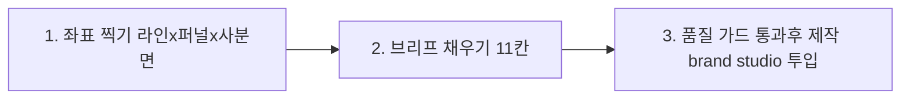
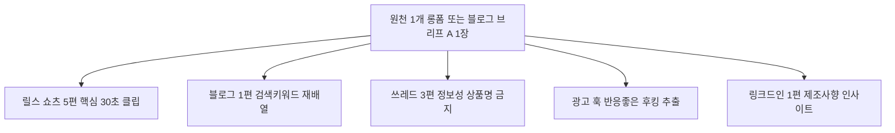

# 오픈아이오티 콘텐츠 기획 템플릿 (기획 브리프)

> 콘텐츠 **1건을 만들기 전에 채우는 한 장짜리 설계도.** 전략 문서의 모든 판단 기준(3라인·퍼널·4사분면·채널 공식·품질 가드)을 이 양식 하나에 빈칸으로 묶었다.
> 무엇을·왜 = [콘텐츠 전략 3라인](오픈아이오티_콘텐츠전략_3라인.md) · [마케팅 전략](오픈아이오티_마케팅전략.md) / 어떻게 = [콘텐츠 제작계획](오픈아이오티_콘텐츠제작계획.md) / 언제 = [30일 캘린더](오픈아이오티_콘텐츠캘린더_30일.md) / 사실 = [회사 정의](../오픈아이오티_회사정의.md) · [company-kb](../brand-studio/data/company-kb.md)
> 작성일: 2026-06-14

---

## 사용법 (3단계)



1. **복사** — 아래 `## A. 콘텐츠 기획 브리프` 블록을 통째로 복사해 새 콘텐츠 1건당 1장 만든다.
2. **위에서부터 채운다** — 0→11 순서. 앞 칸(라인·퍼널)이 뒤 칸(채널·공식·CTA)을 자동으로 결정한다. 막히면 칸마다 달린 `▷ 부록` 참조표를 본다.
3. **품질 가드(10번) 전부 체크되면** brand-studio 초안 생성 → 사람 검수(첫 3초·숫자·사실) → OSMU 분해.

> 빈칸 표기 규칙: `___` = 채울 곳 · `[ ]` = 택1/택다 체크 · `▷` = 참조 위치.

---

## A. 콘텐츠 기획 브리프  〈복사해서 사용〉

```
■ 콘텐츠 ID / 제목(가제):  ___
■ 기획자 / 발행 예정일:  ___ / ___
```

### 0. 한 줄 정의 — 이 콘텐츠의 단 하나의 임무
> "**누구**가 이걸 보고 → **무엇**을 알게 되어 → **어떤 행동**을 하게 만든다."

```
___
```

### 1. 전략 좌표 (가장 먼저 · 나머지를 결정함)   ▷ 부록 ①②③

**1-1. 어느 라인인가** (택1) — 라인마다 통하는 콘텐츠 본질이 다름

- [ ] **L1 풀커스텀(HW+SW)** → 고객 질문 "진짜 칩부터 만들 실력 있나?" → 본질 = **신뢰 증명**(케이스·기술 깊이)
- [ ] **L2 기성+SW** → "내 문제를 빨리·싸게 풀어주나?" → 본질 = **즉시수요 응답**(검색의도 how-to)
- [ ] **L3 자체솔루션** → "이게 실제로 돌아가긴 하나?" → 본질 = **도그푸딩 증명**(직접 운영 수치)

**1-2. 퍼널 어느 단계인가** (택1) — 막힌 한 곳만 (동시 3곳 금지)

- [ ] **트래픽(인지)** — 아직 우리를 모름 / 표본 넓히기
- [ ] **이탈(검토 유지)** — 봤지만 검토 중 사라짐 / 신뢰·깊이 보강
- [ ] **전환(클로징)** — 다 보고도 결정 안 함 / 믿음×구조로 닫기

**1-3. 4사분면** — 두 제품 모두 기본값 **전국 + 정보비대칭** (특수한 지역 타깃일 때만 변경)

```
도달: [ ] 전국  [ ] 지역      정보: [ ] 정보비대칭(품질을 소비자가 모름)  [ ] 이미지
```

> ☑ 좌표 = `L__ × ____단계` → 이 좌표의 추천 채널은 **부록 ②** 매트릭스에서 확인.

### 2. 타깃 — 페르소나 말고 "상황"으로   ▷ 부록 ④(상황 타깃)
> 글천개 원칙: "제조사 사장님"(페르소나) ✕ → "**신규 라인 증설/외주 잠수/규제 대응/심야 도어락 응대**가 터진 순간"(구매 트리거 상황) ○

```
누가:  ___
어떤 상황이 터졌을 때:  ___
```

### 3. 핵심 메시지 & 셀링포인트 — 구체 수치 필수   ▷ 부록 ⑤(수치 은행)
> 추상어("압도적·뛰어난·최고") = 즉시 반려. "잘한다" = 0점. 반드시 숫자.

```
한 문장 메시지:  ___
근거 수치(최소 1개):  ___    (예: 설치 10곳 · 0원 3분 · 정산 3일→클릭 한 번)
손실/비교 프레임:  ___      (예: "매월 새는 손실 ___원" · "경쟁사는 이미 ___, 귀사는 구식")
```

### 4. 후킹 — 첫 3초 / 제목   ▷ 부록 ⑥(제목 포맷)
> 첫 1~2초에 후킹 없으면 즉시 이탈. 첫 장면은 표본 최대(좁은 표현 금지).

```
제목 포맷(택1): [ ]숫자형 [ ]손실위협형 [ ]권위인용형 [ ]비포애프터형 [ ]언매칭형
제목/첫 장면:  ___
```

### 5. 채널 & 포맷 (좌표가 추천 → 확정)   ▷ 부록 ②

```
[ ]릴스/쇼츠  [ ]유튜브 롱폼  [ ]네이버 블로그/SEO  [ ]기술 블로그(국/영)
[ ]인스타 광고  [ ]링크드인  [ ]쓰레드  [ ]콜드 아웃바운드  [ ]cloud 셀프서브 데모
```

### 6. 본문 구조 — 선택한 포맷의 고정 공식 채우기   ▷ 부록 ⑦(공식 모음)
> 해당 포맷 한 줄만 남기고 나머지는 지워서 사용.

```
· 릴스/쇼츠(숏폼 4공식):  후킹(표본넓게)→공감(내 얘기)→가치당기기→반전·숫자→CTA(캡션)
   ___
· 유튜브 롱폼(조회수 4단계): 후킹→가치입증→라포르→도파민→[문제나열→해결시연]→CTA
   ___
· 블로그/SEO(마인드리딩):  고민 2개 맞히기→가치입증(숫자)→구체 증거(반박불가)→CTA
   ___
· 인스타 광고:  타깃공감→고통공감→라포르→숫자·포지셔닝→반박 선제격파→무료강조→간접 클로징
   ___
```

### 7. CTA + 회수 구조   ▷ 부록 ⑧
> 모텔이론: 신뢰 형성 전 계좌/판매 금지. 전환 콘텐츠는 **단일 CTA + 회수(연락처 수집) 한 쌍** 필수.

```
단일 CTA(딱 하나):  ___        (예: 무료 진단 신청 · cloud 가입 · 케이스 PDF 받기)
회수 구조:  ___                (전환 단계면 필수, 인지/이탈이면 "해당없음" 가능)
```

### 8. 근거 & 사실 출처 — 날조 0건   ▷ [company-kb](../brand-studio/data/company-kb.md)
> 쓴 기능·고객사·수치 전부 출처 확인. 없으면 쓰지 않는다.

```
인용한 사실 / 출처:  ___
```

### 9. 원소스 멀티유즈(OSMU) 분해 계획   ▷ 부록 ⑨
> 이 콘텐츠가 원천이면 어디로 쪼갤지, 파생이면 어느 원천에서 왔는지.

```
이 콘텐츠는: [ ]원천(원소스)  [ ]파생(원천: ___)
원천이면 분해 대상:  [ ]릴스 N편  [ ]블로그  [ ]쓰레드  [ ]광고 훅  [ ]링크드인
```

### 10. 품질 가드 체크리스트 — 전부 ☑ 전까지 제작 금지
- [ ] 어느 **라인·퍼널 칸**인지 명확한가 (1번)
- [ ] 첫 1~2초/제목에 **후킹**이 있는가
- [ ] **구체 숫자**가 있는가 ("잘한다" = 0점)
- [ ] 첫 장면 **표본이 넓은가** (좁으면 도달 박살)
- [ ] **추상어**(압도적·뛰어난·최고) 없는가
- [ ] **손실/비교 프레임**으로 긴급성을 만들었는가
- [ ] 신뢰 형성 전 **CTA/계좌부터 들이밀지** 않았는가 (모텔이론)
- [ ] 전환이면 **단일 CTA + 회수** 한 쌍이 있는가
- [ ] L1=수치 케이스/3단계 정보 · L2=검색의도/상황 · L3=도그푸딩 실증 — **라인 조건** 충족하는가
- [ ] **없는 기능·고객사·수치 날조** 없는가 (company-kb 대조)

### 11. KPI — 허영지표 말고 현금 직결   ▷ 부록 ⑩
```
이 콘텐츠 성공 지표(1~2개):  ___
   (트래픽: 도달·저장 / 이탈: 시청지속·체류 / 전환: 리드·가입·미팅·리드단가)
```

`──── 브리프 끝 ────`

---

## B. 주간 배치 기획 (원천 1개 → 전 채널)   ▷ [제작계획 §4·§5](오픈아이오티_콘텐츠제작계획.md)

매주 원천 1개를 정해 위 브리프 A를 1장 쓰고, 그걸 잘게 쪼개 한 주를 채운다.



```
■ 이번 주차 / 테마:  ___
■ 이번 주 막힌 퍼널(택1, 자원 몰빵):  [ ]트래픽  [ ]이탈  [ ]전환
■ 원천 콘텐츠 1개(브리프 A 작성):  ___
■ 분해 산출 목표:  릴스 ___편 · 블로그 ___편 · 쓰레드 ___편 · 광고 ___종 · 링크드인 ___편
■ 우선순위 근거(1줄):  ___
```

> 주간 기본 목표(캘린더 기준): 릴스 4~5 · 롱폼 1 · 블로그 1~2 · 쓰레드 2~3 · 콜드 1배치(50건) · 검색광고 상시.

---

## C. 작성 예시 (빈칸 채운 완성본)

> 우선순위 2번 자산 — cloud 셀프서브 "3분 연동" 데모.

```
■ 콘텐츠 ID / 제목(가제):  L2-001 / "가입부터 첫 기기 대시보드 연동까지, 진짜 3분"
■ 기획자 / 발행 예정일:  마케팅 / 2026-06-09

0. 한 줄 정의:
   IoT 앱 개발 외주를 알아보던 제조사 PM이 → cloud.openiot.app에서 코드 0줄로
   3분 만에 대시보드가 뜨는 걸 보고 → 직접 무료 가입(셀프서브)하게 만든다.

1. 전략 좌표:
   1-1 라인: ☑ L2 기성+SW (즉시수요 응답)
   1-2 퍼널: ☑ 전환(클로징)  ← 자사 유입·셀프서브 가입 직결
   1-3 사분면: 전국 + 정보비대칭

2. 타깃(상황):
   누가: SW팀 없는 제조사 PM/대표
   상황: 기성 IoT 기기는 샀는데 "앱·대시보드는 외주 견적이 수천만원"이라 막힌 순간

3. 메시지 & 수치:
   메시지: "처음부터 만들 필요 없다 — 칩만 연결하면 3분 만에 앱·대시보드가 생긴다"
   수치: 0원 시작 · 3분 · 코드 0줄
   손실/비교: "외주 견적 수천만원·수개월 vs 지금 화면에서 3분"

4. 후킹:
   제목 포맷: ☑ 비포애프터형  (+ 언매칭형 보조)
   첫 장면: "IoT 앱 개발 견적 수천만원 받고 오셨죠? 화면 그대로 보세요." (타이머 0:00 시작)

5. 채널 & 포맷: ☑ cloud 셀프서브 데모(화면녹화) → 릴스/유튜브로 동시 배포

6. 본문 구조(숏폼 4공식 변형 + 화면녹화):
   후킹(견적서 vs 빈 화면)→공감(SW팀 없음)→가치당기기(가입→칩연결 실시간)
   →반전(타이머 3:00 안에 대시보드 완성)→CTA(직접 해보세요 cloud.openiot.app)

7. CTA + 회수:
   단일 CTA: cloud.openiot.app 무료 가입
   회수 구조: 가입 = 이메일 확보 → 미연동 사용자 영업/온보딩 핸드오프

8. 근거/출처:
   cloud.openiot.app·admin.openiot.app 라이브 / "0원·3분" = 회사정의 §2 / 코드 0줄 셀프서브
   (company-kb 대조 완료, 날조 0)

9. OSMU: ☑ 원천 → 릴스 3편(가입/연동/대시보드 컷) · 블로그 1편(how-to) · 쓰레드 2편

10. 품질 가드: 전 항목 ☑ (라인·후킹·숫자·표본·무추상어·비교프레임·모텔·단일CTA·L2조건·무날조)

11. KPI: cloud 무료가입 수 · 가입당 비용(자사유입 비중 = 위시켓 탈피 척도)
```

---

## 부록 — 빠른 참조

### ① 라인 선택기 (1-1용)
| 라인 | 고객이 확인하려는 것 | 콘텐츠 본질 | KB 핵심 무기 |
|---|---|---|---|
| **L1 풀커스텀** | 진짜 칩부터 만들 실력 있나 | 신뢰 증명 | 사례=매출 · 3단계 실전정보 · 모텔이론 |
| **L2 기성+SW** | 내 문제 빨리·싸게 풀어주나 | 즉시수요 응답 | 상황 타깃 · 손실/비교 프레임 |
| **L3 자체솔루션** | 이게 실제로 돌아가나 | 도그푸딩 증명 | 메타 증명 · 숫자 원칙 · 의심 격파 |

### ② 좌표 → 추천 채널 매트릭스 (1번 → 5번 자동 연결)
| | 트래픽(인지) | 이탈(검토 유지) | 전환(클로징) |
|---|---|---|---|
| **L1** | 유튜브 기술 롱폼 · 링크드인 | 산업 Before/After 케이스 · 기술 블로그 | 골프장 케이스 PDF · 콜드 개인화 |
| **L2** | 검색 SEO · 검색광고 | how-to 블로그 · cloud 셀프서브 데모 | 견적/ROI 계산기 · 무료 진단→PoC |
| **L3** | 릴스/쇼츠 · 인스타 | 도입후기 · 도그푸딩 수치 | 셀프서브 무료가입 · 영업 레퍼런스 |

### ③ 4사분면 (1-3용)
도달(지역↔전국) × 정보비대칭(품질을 소비자가 아는가). **두 제품 기본 = 전국 + 정보비대칭** → 유튜브 롱폼·블로그·검색이 주력.

### ④ 상황 타깃 예시 (2번용)
신규 라인 증설 · 외주 잠수/지연 · 규제·인증 대응 · 가동률·다운타임 악화 · 심야 도어락 응대 · 월말 정산 폭탄 · 퇴실 후 냉난방 낭비 · 예약 중복.

### ⑤ 수치 은행 (3번용 — 검증된 사실만)
설치 10곳+ · 0원 시작·3분 연동 · 정산 3일→클릭 한 번 · 운영비 수천만원→수십만원 · 카카오 골프장 납품 · 포트폴리오 18종 · cloud/admin 셀프서브 라이브.

### ⑥ 제목 포맷 (4번용)
- 숫자형: "무인매장 사장님이 모르는 5가지"
- 손실위협형: "이거 모르고 차리면 첫 달에 수백만원 날린다"
- 권위인용형: "카카오에 IoT 납품한 회사가 알려주는 자동화의 정석"
- 비포애프터형: "직접 운영하던 사장 vs 시스템에 맡긴 사장"
- 언매칭형: "무인매장인데 사장님이 24시간 대기 중이라고요"

### ⑦ 채널별 본문 공식 (6번용)
- **릴스 4공식**: 후킹(표본 넓게)→공감→가치당기기→반전·숫자→CTA(캡션) · 한 장면 3초↓ · 명령형
- **롱폼 4단계**: 후킹→가치입증→라포르→도파민 → 문제나열→해결시연 → CTA · 전문용어 1~2개만
- **블로그 마인드리딩**: 고민 2개 맞히기→가치입증(숫자)→구체 증거→CTA · 추상어 절대 금지
- **인스타 광고**: 공감 후킹→고통→라포르→숫자·포지셔닝→반박 선제격파→무료 강조→간접 클로징

### ⑧ CTA 원칙 (7번용)
모텔이론 = 신뢰 전 판매 금지 / 전환=믿음(레퍼런스 수치)×구조(단일 다음 버튼), 둘 중 하나만 없어도 전환 0 / 리드자석엔 회수(연락처) 한 쌍.

### ⑨ OSMU 분해 규칙 (9번용)
릴스 = 롱폼 최고 반응 30초 + 새 후킹 / 쓰레드 = 첫 줄 숫자·상품명 금지 / 블로그 = 같은 내용 검색 키워드로 재배열 / L3 도그푸딩 수치 = L1 콜드·L2 견적의 신뢰 근거로 재인용.

### ⑩ KPI (11번용)
허영지표(조회수·도달만) ✕ → 현금 직결 ○. L1/L2 = 리드 단가·미팅 전환·무료 진단→PoC→본계약·자사유입 비중 / L3 = 도달·저장→셀프서브 가입→영업 재활용 횟수.

### 금지어·반려 사유 (배포 전 최종)
추상어(압도적·뛰어난·최고) · 첫 장면 좁은 표현 · 숫자 없음 · 신뢰 전 CTA · 없는 기능/고객사/수치 날조 · 라인·퍼널 칸 불명확.

---

## 한 장 요약
| 칸 | 질문 | 핵심 |
|---|---|---|
| 0 | 임무는 | 누가→무엇 알고→어떤 행동 |
| 1 | 좌표는 | 라인(L1/L2/L3) × 퍼널(트래픽/이탈/전환) — 나머지를 결정 |
| 2 | 타깃은 | 페르소나 ✕, 구매 트리거 상황 ○ |
| 3 | 메시지는 | 구체 수치 필수, 손실/비교 프레임 |
| 4~6 | 어떻게 | 좌표가 채널·공식 자동 추천 |
| 7 | 닫기 | 모텔이론 + 단일 CTA × 회수 |
| 8·10 | 안전장치 | company-kb 대조 + 품질 가드 10항 |
| 9·11 | 확산·측정 | OSMU 분해 + 현금 직결 KPI |
