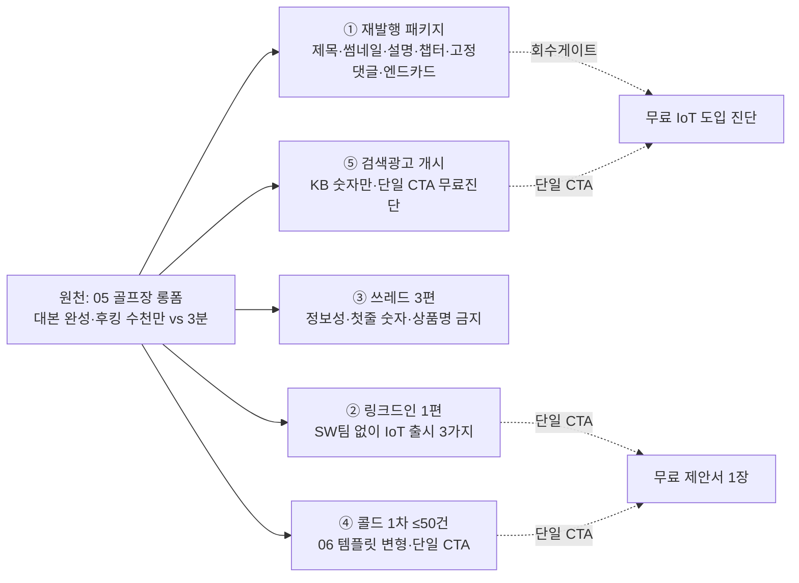

# L1 첫 콘텐츠 — W1 골프장 롱폼 재발행 + OSMU 번들 (실제 발행본)

> 출처 스케줄: [08 3라인 마케팅스케줄 OSMU엔진](08_3라인_마케팅스케줄_OSMU엔진.md) §3-1·§4 **M1 W1(06-15~21) L1 칸**.
> 기획 양식: [08 콘텐츠 기획 템플릿](08_콘텐츠기획_템플릿.md) 브리프.
> 원천 자산: [05 골프장 케이스 유튜브 롱폼](05_openIoT_골프장케이스_유튜브롱폼.md)(대본 완성·검수 통과) · [06 콜드 아웃리치 템플릿](06_openIoT_콜드아웃리치_템플릿.md).
> 사실 근거: [company-kb](../brand-studio/data/company-kb.md) · [회사 정의](../오픈아이오티_회사정의.md). **날조 0건 / KB 밖 숫자 0.**
> 작성일: 2026-06-14 · 발행 예정: 2026-06-15(월)~

---

## 0. 이 번들이 만드는 것 (한눈에)

W1 L1의 ◆원천 아톰(골프장 롱폼)은 **대본이 이미 존재**한다. 그래서 이 번들의 작업은 ① 그 대본을 **실제 유튜브 발행 가능한 패키지**로 완성하고 ② 거기서 **OSMU로 파생**되는 W1 L1 자산 전부를 한 번에 뽑는 것이다.



> **발행 전 필수 수정 1건(골프장 표기 정합화)**: 05 대본 line 1·10·176~180의 "**납품**" 표현 → **"공급/레퍼런스"**로 교체해야 OSMU §5-3 품질 가드 통과. 아래 재발행 제목·후킹은 이미 "공급"으로 고쳐 반영함. (원하면 05 본문도 일괄 패치)

---

## 1. 기획 브리프 (08 템플릿 적용 — 번들 전체 1장)

```
■ 콘텐츠 ID / 제목(가제):  L1-W1 / "IoT 직접 만들면 수천만 원, 칩만 연결하면 3분"
■ 발행 예정일:  2026-06-15(월)~ (롱폼=금 06-20 배포, 파생=목~금)

0. 한 줄 정의:
   IoT 도입을 검토 중인 제조사 대표·CTO·PM이 → "외주 수천만 원 vs 칩 연결 3분/0원"의
   구조 차이와 카카오 골프장 제어시스템 레퍼런스를 보고 → '무료 IoT 도입 진단'을 신청하게 만든다.

1. 전략 좌표:
   1-1 라인: ☑ L1 풀커스텀 (신뢰 증명 — 객단가 최고·단기현금 1순위)
   1-2 퍼널: ☑ 이탈(검토 유지) 보강 → 전환(클로징)  ← 모텔이론: 신뢰 먼저, CTA는 단일
   1-3 사분면: 전국 + 정보비대칭(발주 전 실력 검증 불가)

2. 타깃(상황, 페르소나 금지):
   누가: 제조사 대표·CTO·PM
   상황: ① 신규 라인/신공장 레거시 제어 교체 ② 거래처·규제로 원격 모니터링 필요
        ③ 외주 잠수·지연으로 다운타임 ④ 양산 앞두고 펌웨어·앱 연동에서 막힘

3. 메시지 & 수치(KB 허용 숫자만):
   메시지: "제품에 칩만 연결하면 3분 안에 펌웨어·앱·대시보드 — 0원으로 시작"
   수치: 0원 시작 · 3분 · 설치 10곳+ · 비용 수천만원→수십만원 · 관리자 1명 (전부 사례/기대치 서술)
   손실/비교: "도입 안 해서 매월 새는 비용" + "같은 업종은 이미 IoT로 업그레이드"

4. 후킹:
   제목 포맷: ☑ 숫자형 + 권위인용형  / 첫 장면: "수천만 원 vs 3분" 숫자 대비(이미 대본 line 10)

5. 채널 & 포맷: ☑ 유튜브 롱폼(원천) → ☑ 링크드인 ☑ 쓰레드 ☑ 콜드 ☑ 검색광고
   (L1 매트릭스 준수 — 릴스 비주력: 이번 W1 L1 릴스 0편, 링크드인 네이티브로 대체)

6. 본문 구조: 롱폼 4단계(후킹→가치입증→라포르→도파민)+문제4·해결·케이스·의심격파4·손실비교·CTA
   → 05 대본 그대로(검수 통과). 재발행은 §2 패키징만.

7. CTA + 회수:
   단일 CTA(롱폼/검색광고): 무료 IoT 도입 진단 신청
   단일 CTA(링크드인/콜드): 무료 제안서 1장 (요구사항 한 줄)
   회수 구조: 진단/제안서 신청 = 이메일·회사·제품 정보 확보 → 전담 영업 핸드오프

8. 근거/출처: company-kb 전수 대조. 골프장 = "제어시스템 공급/레퍼런스". 효과수치 = 사례/기대치. 날조 0.

9. OSMU: ☑ 원천 → 링크드인1 · 쓰레드3 · 콜드첨부(1pager 발췌) · 검색광고 훅

10. 품질 가드: §6 체크 (전 항목 ☑ 예정)
11. KPI: 무료 진단/제안서 신청 수 · 콜드 회신율 · 롱폼 시청지속 · (영업)미팅 전환. 조회수=보조참고만.
```

---

## 2. ① 재발행 패키지 (유튜브 발행용)

> 원천 대본은 [05 문서](05_openIoT_골프장케이스_유튜브롱폼.md) 그대로 사용. 아래는 발행에 필요한 메타 자산.

### 2-1. 제목 — A/B 2안 (둘 다 "공급"으로 정합)
- **A안(숫자 대비 직격)**: `IoT 직접 만들면 수천만 원, 칩만 연결하면 3분 | 카카오 골프장에 공급한 회사의 방법`
- **B안(권위+손실)**: `제조사 사장님, IoT 외주 또 부르지 마세요 (칩만 연결 3분 · 0원 시작)`

> 운영: A·B를 썸네일과 묶어 첫 48시간 노출 후 클릭률 높은 쪽 고정. (조회수가 아니라 **진단 신청수/조회** 보조 확인)

### 2-2. 썸네일 — 2시안 (카피 15자 이내·데드존 회피)
| 시안 | 좌(빨강 ✗) | 우(초록 ✓) | 하단 배지 |
|---|---|---|---|
| **T1 분할대비** | 수천만 원·수개월 | 3분·0원 | "카카오 골프장 제어시스템 공급" |
| **T2 명령형** | (대형) "IoT 직접 하지 마세요" | — | 서브 "SW팀 없이 0원 시작" |

### 2-3. 설명문 (SEO — 첫 2줄 = 검색 스니펫·단일 CTA)
```
IoT를 직접 만들면 펌웨어·서버·앱·보안까지 수천만 원에 수개월. 오픈아이오티는 제품에 칩만
연결하면 3분 안에 펌웨어·앱·대시보드가 0원으로 시작됩니다. 카카오 골프장 제어시스템에 공급한 구조입니다.

▶ 무료 IoT 도입 진단 신청: [진단 신청 링크]
   "우리 제품, IoT 될까요?" 한 줄이면 됩니다. (신규 라인 증설·외주 지연·규제 대응·양산 연동 막힘 中 해당 시)

── 다루는 내용 ──
· 제조사가 IoT를 '직접' 못 하는 4가지 진짜 이유 (SW팀·외주비용·기간·커스터마이즈)
· openIoT가 뒤집은 것: 0원 시작 / 3분 내 펌웨어·앱·대시보드 / 커스터마이즈 가능
· 카카오 골프장 제어시스템 공급 + 도그푸딩(오토플레이스 직접 설치 10곳+)
· 가격·커스터마이즈·보안·회사규모 의심격파 / 손실·비교 프레임

오픈아이오티 — 제조업체를 위한 IoT 서비스. (효과 수치는 회사 제시 사례·기대치이며 조건에 따라 다릅니다)
홈: https://openiot.app  ·  무인매장 자동화 데모: https://autoplace.openiot.app

#IoT개발 #제조업IoT #IoT외주 #ESP32 #OTA펌웨어 #스마트팩토리 #Matter #IoT플랫폼 #오픈아이오티
```

### 2-4. 챕터 타임스탬프 (대본 구간 → 목차)
```
00:00  수천만 원 vs 3분 — 왜 이 차이가 나는가
00:15  이 영상은 누구를 위한 것인가 (지금 책상 위의 4가지 상황)
01:30  제조사가 IoT를 '직접' 못 하는 4가지 이유
03:30  openIoT는 무엇이 다른가 — 0원·3분·커스터마이즈
05:30  카카오 골프장 제어시스템 + 우리가 직접 쓴다(오토플레이스 10곳+)
07:00  의심격파 — 가격·커스터마이즈·보안·회사규모
09:00  왜 지금인가 — 손실·비교 프레임
10:30  다음 단계 — 무료 IoT 도입 진단
```

### 2-5. 고정 댓글 (자기선별 + 단일 CTA)
```
이 영상이 맞는 분은 딱 정해져 있습니다 👇
 · 신규 라인/신공장 레거시 제어 교체를 검토 중
 · 거래처·규제로 원격 모니터링·데이터 보고가 필요해짐
 · 맡긴 외주가 잠수·지연돼 다운타임 원인도 못 찾는 중
 · 양산 앞두고 펌웨어·앱 연동에서 막힘
하나라도 책상 위에 있다면 → 무료 IoT 도입 진단: [진단 링크]
("우리 제품, IoT 될까요?" 한 줄이면 됩니다. 안 맞으면 그 자리에서 안 맞다고 먼저 말씀드립니다.)
```

### 2-6. 엔드카드 / 카드
- **엔드카드(주)**: "무료 IoT 도입 진단 신청"(단독·최우선) · 구독 · 다음 영상(예정: ESP32 양산 펌웨어 딥다이브 = W5 A4)
- **카드**: 05:30 지점에 오토플레이스 자동화 데모 카드(도그푸딩 보강)

---

## 3. ② 링크드인 1편 — "SW팀 없이 IoT 제품 출시하는 3가지 방법"

> 네이티브 텍스트 포스트(외부 링크 본문 금지·댓글에). 타깃 CTO·대표. 모텔이론: 정보 먼저, CTA 단일(무료 제안서). 3가지 = 회사 정의의 3라인(고객 선택지) 그대로.

```
제품은 잘 만드는데, 그 위에 IoT를 올리려는 순간 막히는 제조사를 자주 봅니다.
펌웨어·백엔드·앱·보안 — 이 조합이 인력 구조에 통째로 비어 있기 때문입니다.

SW팀을 새로 꾸리지 않고 제품을 IoT로 출시하는 길은 사실 세 가지뿐입니다.

1) 칩부터 앱까지 통째로 맡긴다 (풀커스텀)
   제품에 칩만 연결하면 펌웨어·앱·대시보드가 3분 안에, 0원으로 시작. 커스터마이즈 가능.
   카카오 골프장 제어시스템도 이 구조로 공급했습니다.

2) 검증된 기성 IoT 위에 SW만 얹는다
   SmartThings·헤이홈·Matter 같은 기성 하드웨어 위에 앱·웹·연동만 빠르게.
   처음부터 다 만들 필요가 없으니 더 싸고 빠릅니다.

3) 이미 만들어진 솔루션을 그대로 쓴다
   우리가 직접 운영하는 자체 솔루션(무인매장 자동화 등)을 그대로 도입. 즉시 가동.

핵심은 따로 있습니다. 저희는 이 플랫폼을 남한테만 팔지 않고,
무인매장 10곳 이상에 직접 설치·운영하며 매일 같은 기술을 돌립니다.
도구 파는 회사는 많아도, 그 도구로 자기 매장을 10곳 넘게 돌려본 회사는 드뭅니다.

귀사 제품 한 종 기준으로 "이게 IoT로 붙는가, 구성·일정은 어떤가"를
무료 제안서 한 장으로 정리해 드립니다. 요구사항 한 줄이면 됩니다. (댓글/DM)

(효과·수치는 회사가 제시하는 사례·기대치이며 조건에 따라 다릅니다.)

#IoT #제조업 #하드웨어 #ESP32 #Matter #IoT플랫폼 #CTO
```
> CTA 단일(무료 제안서). 링크는 본문 말고 첫 댓글에 1개. 롱폼 클립을 붙이면 링크드인 네이티브 영상 1편으로 재활용(L1 릴스 대체).

---

## 4. ③ 쓰레드 3편 (정보성·첫줄 숫자·상품명 금지)

> OSMU §5-3: 쓰레드는 정보성, **상품명 언급 금지**, 첫 줄 숫자, 링크 1개 이하. 롱폼 본문에서 발췌.

**쓰레드 1 — 외주 견적 해부**
```
IoT 외주 견적 "수천만 원". 그 돈이 어디서 나가는지 뜯어봤습니다.
펌웨어, 백엔드 서버, 앱, 보안 — 네 덩어리를 따로 붙이는 비용입니다.
더 큰 문제는 이게 '자산'이 안 남는다는 것. 끝나면 또 부릅니다.
출고 뒤 펌웨어를 못 고치면, 회수해서 고치는 비용이 매월 또 샙니다.
체크 포인트는 가격이 아니라 "출고 후에도 운영 가능한 시스템이 남는가"입니다.
```

**쓰레드 2 — OTA가 왜 중요한가**
```
출고된 IoT 제품에서 펌웨어 버그가 나면? 답은 OTA입니다.
OTA(무선 펌웨어 배포) = 현장 제품을 회수하지 않고 원격으로 펌웨어를 갱신.
배포 대상·방식(스냅샷·연속)·롤아웃·스케줄까지 정해서 단계적으로 내보냅니다.
즉 "출고 = 끝"이 아니라, 출고 뒤에도 기능을 고치고 버그를 잡을 수 있다는 뜻.
양산 제품에서 이게 되느냐 안 되느냐는 운영비 차원이 완전히 다릅니다.
```

**쓰레드 3 — IoT 보안 최소 체크리스트**
```
IoT는 뚫리면 끝. 최소한 이 5가지는 확인하세요.
1) 기기 인증 — Matter 인증, X.509 인증서
2) 통신 암호화 — TLS 기반 MQTT
3) 권한 — IAM 최소권한, 시간 기반 제어 권한 제한
4) 관리자 인증 — 토큰/패스코드 권한 검증
5) 운영 — 무중단 배포·모니터링으로 이상 탐지
공간 제어처럼 변명이 안 통하는 환경일수록 이 스택이 기본값이어야 합니다.
```
> 발행: 수·금 분산. 프로필 링크 1개(무료 진단)만. 본문 내 상품명·CTA 문구 없음.

---

## 5. ④ 콜드 1차 배치 ≤50건 (06 템플릿 운용안)

> 06 템플릿에서 W1용으로 **변형·선택**만. 신규 작성 아님. 단일 CTA = **무료 제안서**(W1은 진입장벽 낮은 제안서로 통일, 통화는 회신 온 warm 리드만).

### 5-1. W1 발송 구성 (총 ≤50)
| 채널 | 건수 | 사용 변형(06) | 트리거 | 단일 CTA |
|---|---|---|---|---|
| 링크드인 DM | 25 | **DM-1**(상황 후킹, 신규 라인) / 보조 DM-3(CTO 기술) | 신규 라인·설비 증설 | 무료 제안서 |
| 콜드메일 | 25 | **메일-1**(손실 프레임, 양산 직전) / 보조 메일-2(스타트업 비교) | 양산 직전·외주 지연 | 무료 제안서 |

> CTA 통일을 위해 06 메일-1의 "15분 통화"는 W1 배치에서 **"무료 제안서 한 줄"**로 교체해 발송(혼용 금지). 통화 CTA는 회신 후 2차에서.

### 5-2. 첫 줄 변형 3종 (상황 타깃·A/B용 — 첫 줄은 '상대 상황'으로)
```
V1 (신규 라인):  [회사명]이 [제품/라인]을 IoT로 올리려 외주 견적을 받아보셨다면, "수천만 원·몇 개월"에서 한 번 멈추셨을 겁니다.
V2 (외주 지연):  맡기신 IoT 건이 펌웨어·앱·대시보드를 따로 붙이느라 일정이 밀리고 있다면,
V3 (규제·원격):  거래처·규제 때문에 [제품/라인]에 원격 모니터링·데이터 보고가 갑자기 필요해지셨다면,
```
이후 본문은 06 고정 사실 블록(칩 연결→3분·0원·커스터마이즈 / 카카오 골프장 제어시스템 공급 / 오토플레이스 10곳+ / 효과는 사례·기대치) 그대로.

### 5-3. 발송 규칙 (스케줄 §0-2·§2-2·§10 캐파 종속)
- 금요일 발송. **리서치 완료 리드 풀에 종속** — 풀이 마르면 50건 미만으로 자동 감소(억지 채움 금지).
- **영업 미팅 8슬롯/주 상한.** 회신이 캐파 초과면 다음 배치 발송량을 줄인다(역방향 제어).
- 발송 전 06 §(d) **체크리스트 6항** 전건 통과(첫줄 상황·CTA 단일·효과 단서·KB 밖 숫자 0·변수 전건 치환·6문장 이내).

---

## 6. ⑤ 검색광고 개시 (KB 숫자만·단일 CTA)

> W1 L1 칸의 "검색광고 개시". 의도 높은 수요 직격. 랜딩 = 무료 진단(롱폼과 동일 종착지).

### 6-1. 키워드 (KB 근거 수요)
- 의도 강: `IoT 개발 외주`, `IoT 플랫폼`, `ESP32 펌웨어 개발`, `BLE 앱 개발 외주`, `OTA 펌웨어 배포`
- 산업: `스마트팩토리 IoT`, `제조업 IoT 도입`, `Matter 기기 개발`
- (3주차부터 영문: `IoT development outsourcing` 등 — W9 연계)

### 6-2. 광고 카피 (헤드라인/설명 — 3종씩 AB)
```
H1: IoT 외주 수천만 원? 칩만 연결하면 3분    H2: 0원으로 시작하는 제조업 IoT
H3: 카카오 골프장에 공급한 IoT 플랫폼
D1: 펌웨어·앱·대시보드 자동 연동. 커스터마이즈 가능. 무료 IoT 도입 진단 신청.
D2: SW팀 없이 제품을 IoT로. OTA·Matter·AWS 서버리스. 적합 여부 무료 진단.
```
- 단일 CTA: **무료 IoT 도입 진단**. 효과 수치 광고문구에 단정 금지(사례/기대치는 랜딩에서).
- 측정: 키워드별 CPL(리드 단가) → 일요일 검수 → 단가 낮은 키워드 예산 집중(W2).

---

## 7. 품질 가드 & 사실 출처 (배포 전 최종 — 전 항목 ☑)

| 가드(08 §10 + OSMU §5-3) | 상태 |
|---|---|
| 라인·퍼널 칸 명확 (L1 × 이탈→전환) | ☑ |
| 첫 3초/제목 후킹 (수천만 vs 3분) | ☑ |
| 구체 숫자 — **KB 허용분만**(0원·3분·10곳+·수천만→수십만·관리자 1명) | ☑ |
| 추상어(압도적·최고) 없음 | ☑ |
| 손실/비교 프레임 있음 | ☑ |
| 모텔이론 — 신뢰 먼저, CTA 단일 | ☑ |
| 회수 구조(진단/제안서 = 연락처 확보) 한 쌍 | ☑ |
| **골프장 = "제어시스템 공급/레퍼런스"** (납품·최강무기 단정 금지) | ☑ (재발행 제목/후킹 정합, 05 본문 패치 권고) |
| 효과수치 = 사례·기대치 서술 | ☑ |
| 쓰레드 상품명 금지 | ☑ |
| 없는 기능/고객사/수치 날조 0 (company-kb 대조) | ☑ |

**인용한 사실(전부 company-kb 근거)**: 칩 연결→3분 펌웨어·앱·대시보드 / 0원 시작·커스터마이즈 / 카카오 골프장 제어시스템 공급 / 오토플레이스 설치 10곳+(어반클래식·코이노니아·제이엔터) / 비용 수천만원→수십만원·관리자 1명(사례·기대치) / OTA(S3·스냅샷·연속·롤아웃·스케줄) / Matter·Zigbee·Thread·Wi-Fi·BLE / TLS MQTT·X.509·IAM 최소권한·Cognito·시간기반 제어 / AWS 서버리스 / 2021 시작·누적주문 100건+·2025 양산 완성.

---

## 8. 발행 체크 & 다음 단계

**발행 순서(W1)**
1. (발행 전) 05 대본 "납품"→"공급" 패치 + 진단 랜딩/링크 확정
2. 목: 쓰레드 1·2 발행, 콜드 리스트·변수 치환 완료
3. 금: 롱폼(A/B 썸네일) 배포 + 링크드인 1편 + 콜드 ≤50 발송 + 검색광고 ON + 쓰레드 3
4. 일: CPL·콜드 회신율·시청지속·진단 신청수 측정 → 막힌 한 곳 진단 → W2 부스트 라인 지정

**바로 이어지는 OSMU(스케줄)**: W2 ◆A2 롱폼 '외주 5가지'(신규 원천) · 콜드 2차 · 콜드첨부용 1-pager 발췌. 이 번들의 콜드 첨부에는 카카오 1-pager(기존)를 사용.

---

## 한 장 요약
| 산출물 | 핵심 | 단일 CTA |
|---|---|---|
| ① 재발행 패키지 | 제목 A/B·썸네일 2·SEO 설명·챕터·고정댓글·엔드카드 | 무료 IoT 도입 진단 |
| ② 링크드인 | "SW팀 없이 IoT 출시 3가지" = 3라인 선택지 | 무료 제안서 1장 |
| ③ 쓰레드 3 | 외주 해부·OTA·보안 체크 (상품명 0) | 프로필 링크(진단) |
| ④ 콜드 ≤50 | DM-1+메일-1 변형, 첫줄 상황 3종 | 무료 제안서 |
| ⑤ 검색광고 | KB 숫자 키워드·카피 3종 AB | 무료 IoT 도입 진단 |
| 공통 가드 | 골프장="공급", 효과=사례/기대치, KB 밖 숫자 0 | — |
