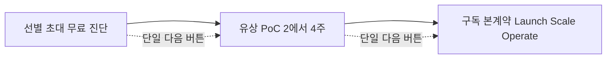

# openIoT 구독 상품 최종 설계서 — Connect 플랫폼 액세스 구독 (Device-Metered SaaS)

작성: 사업개발 책임자 | 기준일 2026-06-08 | 목표 가격대: 월 150~300만원 MRR

---

## 1. 한 줄 결론

**openIoT는 "openIoT Connect — 플랫폼 액세스 구독(Device-Metered SaaS)"으로 간다.** 제품에 칩만 연결하면 3분 내 펌웨어·앱·대시보드가 자동연동되는 IoT 운영 인프라를, 외주 한 번이 아니라 **연결 기기 수·앱(서비스) 수·OTA 배포량만큼 자라는 '항상 켜진 플랫폼'으로 매달 임대**한다. 딜리버리가 AWS 서버리스 종량제를 그대로 타기 때문에 계약이 늘어도 단위경제가 깨지지 않는 것이 5개 후보 중 단기 현금흐름·고정비 동결에 가장 정합한 이유다. 단, 순수 액세스 구독의 유일한 약점인 "왜 외주 한 번이 아니라 매달이냐"는 반론과 "초기 기기 수가 적은 고객의 가격 체감"은, 다른 설계안의 베스트 아이디어(ROI·손실 프레임, PoC baseline 측정, 검증 연동 카탈로그, 무인공간 수직 우선 진입, 운영시간 가드레일)를 이식해 보완한다.

---

## 2. 왜 구독으로 가야 하는가 — 외주(프로젝트) 대비 구독(MRR)의 구조적 이점

### 2.1 글천개 매출 3분해: 구독은 '구매빈도'를 상수로 박는 장치

> **매출 = 고객수 × 구매빈도 × 가격**

| 항목 | 외주(위시켓·크몽) | 구독(Connect) |
|---|---|---|
| 구매빈도 | 변동(프로젝트마다 새 발주·새 견적·잠수 리스크) | **상수로 고정(매달)** |
| 매출 예측성 | 들쭉날쭉, 평탄화 불가 | 확정 MRR, 평탄화 가능 |
| 가치 발생 시점 | 납품 시점에 종료 | **기기가 필드에서 도는 매달 새로 발생** |
| 한계비용 | 매건 사람-시간 재투입 | AWS 종량제 + 자동연동 재사용 |

외주는 코드를 한 번 만들어 던지면 끝이고, 다음 기능은 또 새 견적·새 잠수 리스크다. 현재 openIoT의 B2B 매출이 위시켓·크몽 프로젝트성에 의존해 변동성이 큰 이유가 여기 있다. 구독은 이 '구매빈도'를 구조적으로 매달로 고정한다.

### 2.2 가격설정 플레이북: 구독 = 구조적 재구매(최고점 사업구조)

- SW·서비스는 **본질강화 가능 품목**이라 고객 불편을 하나씩 제거하며 가격 인상 여지가 무한하다.
- 구독은 플레이북이 가리키는 '구조적 재구매'를 실현하는 형태다. 초기 저가(Launch 150만)로 줄을 세운 뒤 초과수요를 만들고 단계적으로 인상하는 경로가 그대로 깔린다.
- 순이익 레버리지: **가격 15% 차이가 순이익 2배**. 150/225/300 band를 잡아두면 이 레버리지를 티어 이동만으로 흡수한다.

### 2.3 IoT의 본질: 출시는 끝이 아니라 시작

IoT 제품은 납품 다음 날부터 (1) 필드 기기에서 버그·보안 패치가 나오고(OTA로 매번 배포해야 함), (2) 통신 표준(Matter·Zigbee·Thread·Wi-Fi·BLE)과 AWS 런타임이 계속 바뀌고, (3) 기기·사용자가 늘며 서버 부하가 커지고, (4) X.509 인증서 만료·권한·보안이 상시 관리되어야 한다. 일회성 외주는 '받는 순간 노후화가 시작되는 자산'이고, 받은 회사는 이를 돌릴 **개발팀+운영팀**을 떠안는다. 구독은 이 부담을 매달 우리가 떠안는 구조다 — KB 효과 표현 **"개발팀+운영팀 → 관리자 1명"**이 매달 갱신되는 이유.

---

## 3. 추천 모델 상세

### 3.1 무엇을 구독하는가 (whatIsSubscribed)

매달 구독하는 것은 '코드 한 벌'이 아니라 **제품이 시장에서 살아 있는 동안 계속 돌아가는 IoT 운영 인프라 전체에 대한 액세스**다.

1. **연결 기기 백엔드** — 연결된 기기 N대를 실시간으로 받아내는 AWS 서버리스(IoT Core·Lambda·DynamoDB·API Gateway·Cognito). 기기가 늘어도 우리가 받아낸다.
2. **앱(서비스 단위) 운영** — 앱(서비스) M개에 대한 펌웨어·모바일앱·관리자 대시보드 자동연동과 운영. (KB: 앱=서비스 단위 생성·관리)
3. **OTA(FOTA) 배포 채널** — S3 업로드·스냅샷/연속 롤아웃·스케줄로 필드의 모든 기기를 원격 업데이트.
4. **관리자 대시보드의 살아있는 지표** — 유입·활성 사용자/기기·리텐션·FOTA 현황 시각화, 사용자/그룹/기기/인증서 관리, 센서 데이터 조회. (KB 202 admin 그대로)
5. **보안 운영** — TLS MQTT·X.509·IAM 최소권한·시간기반 제어권한.

즉 '매달 받는 것' = 기기가 늘고, 펌웨어를 고치고, 사용자가 쌓이는 동안 끊김 없이 돌아가는 운영 그 자체.

### 3.2 왜 매달 돈을 내나 (whyRecurring) — 영업 첫 줄 게이트키퍼

> **게이트키퍼 1줄(영업 모든 자료 표준 탑재):**
> "이 돈을 안 내면 (a) 필드 기기에 보안 패치 한 줄도 못 내보내고, (b) 기기가 늘 때마다 서버를 직접 증설해야 하고, (c) 대시보드가 죽어 무슨 일이 일어나는지 모릅니다. **구독료는 '기능 사용료'가 아니라 '제품이 필드에서 계속 살아있게 하는 운영 비용'입니다.**"

이 한 줄을 영업 첫 줄에 박아 순수 액세스 구독이 가격비교 테이블에 갇히지 않게 한다. whyRecurring(OTA·보안·확장 부담의 상시성)을 게이트키퍼로 먼저 세우지 못하면 "외주 한 번이면 되는데 왜 매달?"에 막힌다.

**ROI·손실 프레임(모델1·3 이식, 클로징 표준 문구):**
- "운영팀 1명 인건비만 월 400~600만원인데, 구독은 그 절반 이하 비용으로 인프라·OTA·모니터링·보안을 통째로 대행합니다." (※ 인건비 수치는 일반 시장 표현으로, openIoT 보장 아님)
- "월 225만원짜리 운영팀 하나를, 사람 한 명 채용비의 일부로 매달 빌리는 겁니다."

> 모든 효과 수치(비용 수천만원→수십만원, 개발팀+운영팀→관리자 1명)는 **보장이 아닌 회사가 제시하는 사례·기대치 표현**으로만 서술한다(KB 원칙).

---

## 4. 가격 티어 표

3개 티어, band 150/225/300. **기기 대수 상한·OTA 횟수·앱 개수는 KB에 명시되지 않은 패키징 설계 변수**이며, 실제 AWS 단위경제(IoT Core·Lambda·DynamoDB 비용)로 마진 검증 후 확정한다. 아래 수치는 초기 제안값이며 고객에게 '검증된 기술 한계'로 단정하지 않는다.

| | **Launch (런치)** | **Scale (스케일) — 권장** | **Operate (오퍼레이트)** |
|---|---|---|---|
| **월 가격(KRW)** | 1,500,000 | 2,250,000 | 3,000,000 |
| **연결 기기(패키징값)** | 최대 1,000대 | 최대 5,000대(자동 확장) | 대규모(20,000대+) 자동 흡수 |
| **앱(서비스)** | 1개 | 최대 3개(라인별 분리 운영) | 무제한 |
| **OTA(FOTA) 배포** | 월 4회·스냅샷 롤아웃·스케줄 | 무제한 + 연속(canary) 롤아웃·스케줄 | 무제한 + 연속 롤아웃·롤백·스케줄 풀세트 |
| **대시보드** | 유입·활성·리텐션·FOTA 시각화, 사용자/그룹/기기/인증서 관리, 센서 데이터 조회 | 멀티 앱 통합 모니터링(앱별 비교) | 멀티공간/멀티라인 통합 모니터링 |
| **통신 표준** | 1종(Wi-Fi/BLE 또는 Matter·Zigbee·Thread 중 택1) | 다중(Matter·Zigbee·Thread·Wi-Fi·BLE 혼합) | 다중 + 인증서 라이프사이클 관리 |
| **보안** | TLS MQTT·X.509·IAM 최소권한·시간기반 제어권한 | + 무중단 배포·CloudWatch 운영 모니터링 | + X.509 인증서 라이프사이클·IAM 최소권한 감사 |
| **운영/지원** | 이메일·채널 응대(영업일) | 분기 1회 펌웨어/연동 커스터마이즈 1건 | 우선 장애 대응·운영 SLA 협의 + 전담 운영 창구 |
| **타깃** | 첫 IoT 제품을 양산·출시한 제조사. 기기 한 종·서비스 하나로 '필드에서 돌아가는 것'을 검증하려는 라이트형 표준 고객 | 제품 라인을 증설했거나(신규 라인·신공장) 기존 외주가 잠수해 운영이 막힌 중견 제조사 | 카카오 골프장 제어시스템급 미션크리티컬, 또는 오토플레이스처럼 다지점·다기기를 24시간 무인 운영하는 사업자. 다운타임=매출 손실 |

### 4.1 애드온 (상위 가치·기기 수 약점 보완)

> 모델4의 **검증된 연동 카탈로그**를 Scale/Operate 가치로 이식. 기기 수가 적은 초기 고객이 'band 대비 기기 수가 적다'고 느끼는 약점을 '연동·운영 자산'으로 메운다. 아래는 전부 KB에 명시된 실제 보유 연동이다.

| 애드온 | 내용(KB 근거) | 적용 티어 |
|---|---|---|
| 결제 연동 | 토스페이먼츠·카카오페이 연동 적용 | Scale·Operate |
| 알림 연동 | NCP AlimTalk(카카오톡 알림톡) 연동 적용 | Scale·Operate |
| 기기 제어 연동 | SmartThings·헤이홈(Hejhome/goqual.io) 연동 적용 | Scale·Operate |
| 커스터마이즈 공수(추가 1건) | 합의 범위 내 펌웨어/대시보드/연동 반영 | 전 티어(초과분 별도 견적) |
| 우선 장애 대응 큐 | 핵심 장애 우선 처리(운영시간 상한 내) | Scale 옵션 / Operate 기본 |

---

## 5. 온보딩 퍼널 — 선별 초대(무료 진단 → 유상 PoC → 구독 전환)

글천개 선별 초대 퍼널 그대로. **전환 = 믿음(레퍼런스 수치) × 구조(단일 다음 버튼)** — 둘 중 하나만 없어도 0.

**0단계 — 진입 마찰 제거(0원 시작).** KB 강점 "0원 시작·칩만 연결하면 3분 자동연동"을 그대로 활용해 첫 문턱을 없앤다.

**1단계 — 무료 진단(선별 초대).** '아무나'가 아니라 **이미 IoT 도입 의지가 있고 예산 단계인 제조사**만 초대. B2B 전담 영업이 현재 기기 종류·예상 연결 수·OTA 필요성·운영 인력 현황을 점검하고, **'미도입으로 매월 새는 손실'(개발팀+운영팀 인건비, 패치 못 내보내는 리스크)을 수치로 정리한 1페이지 진단서**를 제공. 이 진단서가 회수 구조의 입구(연락처·의사결정권 확인). ICP 스크리닝으로 라이트형(표준 요구·결정권·예산)만 통과, 핸드홀딩만 요구하는 진상·헤비는 입구에서 거른다.

**2단계 — 유상 PoC(2~4주, 일회성).** 고객 실제 기기 1종을 칩 연결 → 펌웨어·앱·대시보드 자동연동까지 띄우고 **OTA 배포 1회를 실제로 시연**. PoC는 '무상 개발 과지출 금지'(현금 방어) 원칙에 따라 **반드시 유상** — 단기 현금에 즉시 기여하고 진성고객만 통과시키는 필터. PoC 비용은 본계약 전환 시 일부 크레딧.

> **모델3 PoC baseline 측정 메커니즘 이식(환불 보증은 제외).** 유상 PoC에서 가동률·다운타임·'관리자 1명 운영 가능 상태'를 고객과 **숫자로 측정·합의**해둔다. 환불 보증을 걸지 않고도 이 측정값이 '전환=믿음×구조'의 믿음 축을 채울 구체 성과 수치가 된다. KB 보장 금지 원칙을 지키면서 측정된 결과 서사만 흡수.

**3단계 — 구독 본계약.** PoC에서 살아 움직인 그 환경을 그대로 Launch/Scale/Operate 티어로 이관 → 매달 구독 전환. 전담 영업이 진단 참가자를 직접 클로징하며, 모든 단계 말미에 **단일 다음 버튼**("PoC 신청" → "구독 전환")만 제시한다.

**첫 줄세우기 세그먼트 — 무인공간 수직 우선 진입(모델5 이식).** 오토플레이스 10곳+ 도그푸딩이 살아있는 무인공간 수직을 **최초 줄세우기 세그먼트**로 좁힌다. 검증 레퍼런스가 있는 한 곳에 집중해 초기 전환율과 현금 회수 속도를 높이고, 다른 산업은 PoC 레퍼런스 확보 후 확장한다.

---

## 6. 이탈 방어(churn) — 본질이 우리에게 귀속되는 4중 잠금

| # | 잠금 | 끊는 순간 발생하는 일 |
|---|---|---|
| 1 | **OTA 채널 귀속** | 필드 모든 기기에 펌웨어를 내보내는 유일한 경로가 우리 플랫폼(S3·스냅샷/연속 롤아웃·스케줄). 구독을 끊으면 그날부터 보안 패치·버그 수정을 단 한 대에도 못 내보낸다 — 제품이 노후화·무방비 상태로 고정. |
| 2 | **운영 데이터·지표 귀속** | 유입·활성·리텐션·센서 데이터·FOTA 이력이 우리 대시보드(DynamoDB)에 누적. 이탈하면 '무슨 일이 일어나는지 보는 눈'을 잃는다. |
| 3 | **인증서·보안 라이프사이클 귀속** | X.509 디바이스 인증서·TLS MQTT·시간기반 제어권한을 우리가 발급·관리. 이전·재구축은 전 기기 재인증을 의미해 사실상 큰 비용. |
| 4 | **도그푸딩 신뢰 잠금** | 우리가 오토플레이스 10곳+를 같은 플랫폼으로 직접 운영 중이라, '운영을 아는 벤더'를 떠나 일회성 외주로 돌아갈수록 운영 리스크가 커진다. |

**양(陽)의 락인:** 쓰는 만큼(기기·앱·OTA) 플랫폼에 더 깊이 묶이므로 이탈 비용이 시간이 갈수록 상승한다. **단, 락인이 신뢰를 깨지 않도록** — 표준 데이터 추출·이관 조항을 계약서에 명시(친절함·정보 완전공개)하여 고객이 '강제 락인'으로 인식하지 않게 한다. 귀속은 '안전한 전속 운영'으로 포지셔닝한다.

---

## 7. 가치 정당화·세일즈 화법

### 7.1 제안서 구조: 비판 → 수치적 대안 → 비용계산 → 기대효과 → ROI

| 단계 | 내용 |
|---|---|
| **비판(문제)** | "지금은 위시켓·크몽에 매번 재발주하고, 외주 잠수 리스크를 안고, 출시 후 OTA·인증서·서버 운영을 고객사가 떠안는 구조입니다." |
| **대안** | "openIoT Connect로 펌웨어·앱·대시보드·OTA·보안 운영을 '항상 켜진 플랫폼'으로 매달 구독하세요." |
| **비용계산** | "운영 가능한 IoT 개발자 1명 인건비만 월 수백만원, 개발팀+운영팀이면 그 몇 배입니다. (KB 효과 표현 기준)" |
| **기대효과(수치, 사례·기대치)** | "비용 수천만원 → 수십만원, 인력 개발팀+운영팀 → 관리자 1명." |
| **ROI 클로징** | **"300만 들여 1,000만 이상 가져가는 구조입니다."** |

### 7.2 "비싸요" = 가치설득 실패 신호

가격 저항이 오면 깎지 말고 **가치제안을 다시** 한다. whyRecurring 게이트키퍼(OTA·보안·확장의 상시성)와 손실 프레임("매월 내는 게 아니라 매월 안 새게 막는 것")을 재제시한다. Launch 150만 진입 티어로 의심을 낮추고, 줄세우기로 초과수요를 만든 뒤 본질강화로 단계적 인상한다.

### 7.3 리스크 리버설(확신 시그널)

- **PoC 만족 기준 시그널:** PoC 또는 첫 1개월 결과가 PoC에서 합의한 baseline에 못 미치면 환불 시그널을 걸어 '비싸요'를 가치 설득으로 돌파한다.
- **주의:** 환불·리스크 리버설은 **PoC에서 측정·합의한 지표(가동률·다운타임 등)에만 한정**한다. 검증 불가한 산업 절감 수치(수천만원→수십만원)에 결과 보장을 걸지 않는다 — KB 보장 금지 원칙 준수. 환불 범위·산정식은 계약서에 명문화한다.

---

## 8. 현금 방어 — 단기 현금흐름(6개월 1순위) 지키기

| 룰 | 적용 |
|---|---|
| **MRR 전환** | 위시켓·크몽 프로젝트성 매출을 월 150~300만원 확정 MRR로 전환, 구매빈도를 상수화해 변동성 평탄화. |
| **유상 PoC 선현금** | 구독 전환 전에 즉시 일회성 현금 발생(진성 필터 겸 현금원). 무상 PoC 개발 금지. |
| **고정비 동결** | 기존 AWS 서버리스(쓴 만큼 과금)·자동연동 코드·전담 영업을 그대로 활용 → 신규 고정비 0에 가깝게 시작. 수주가 늘어도 사무실·정규직 선제 투입 금지. |
| **변동비 흡수** | 운영 부하 증가는 외주·계약직·파트너 같은 변동비로 흡수해 단위경제 유지. |
| **초기 과지출 금지** | 대형 데모환경·무리한 무상 PoC 등 일회성 과지출 금지 → 현금 소진→단가 후려치기 끌려감 차단. |

**MRR 시나리오(예시):** 12계약 확보 시(평균 2.25백만 가정) 월 약 2,700만원 MRR. 단기 현금은 **'이미 인지된 핫리드 직접 영업 + 유상 PoC 선현금'의 투트랙**으로 메운다(B2B 영업 사이클이 길어 6개월 내 전환 수가 기대보다 적을 수 있으므로 현실 캘리브레이션).

---

## 9. 리스크와 대응

| 리스크 | 대응 |
|---|---|
| **순수 액세스 '왜 매달이냐' 반론** | whyRecurring(OTA·보안·확장의 상시성)을 영업 첫 줄 게이트키퍼로 박는다(§3.2). 가격비교 테이블에 갇히지 않게 한다. |
| **초기 기기 수 적은 고객의 가격 체감** | Launch는 기기 수가 아니라 '운영 부담 제거·OTA 채널 확보' 가치로 클로징. 검증 연동 카탈로그(§4.1)를 추가 가치로 제시. |
| **패키징 수치(기기 상한·OTA 횟수)를 '검증된 한계'로 단정** | 실제 AWS 단위경제로 마진 검증 후 확정. 고객에게는 '상업 패키징 조건'으로만 제시, 기술 한계로 단정 금지. |
| **Operate 티어 SLA·우선 장애 대응이 캐파 초과** | 고객 자격 필터로 진상·헤비 거르고, 변동비(파트너·계약직)로 흡수 가능한 범위에서만 SLA 약속. SLA는 '대응시간·절차'로 한정, 가동률 단정(99.9% 등) 금지. |
| **진상 1건이 단위경제 잠식(모델1·4 가드레일 이식)** | **계약당 운영시간 상한·초과분 추가 견적·ICP 스크리닝을 계약서에 명문화.** Operate의 우선 장애대응·커스터마이즈는 인력 바운드이므로 상한 사전 정의 필수. |
| **레퍼런스 오용(사실정합)** | 어반클래식·코이노니아·제이엔터는 **오토플레이스 고객이지 플랫폼 구독 레퍼런스가 아님**을 영업 자료에서 분리. 플랫폼 신뢰 근거는 **카카오 골프장·오토플레이스 도그푸딩**만 사용. |
| **B2B 영업 사이클 길이** | 핫리드 직접 영업 + 유상 PoC 선현금 투트랙. 월별 필요 계약 금액을 환경화해 캘리브레이션. |
| **해지 시 데이터·인프라 이관** | 표준 데이터 추출·이관 조항 명시. 락인을 '안전한 전속 운영'으로 포지셔닝(§6). |

---

## 10. 90일 출시 로드맵

| 기간 | 단계 | 핵심 산출물 | 완료 기준(DoD) |
|---|---|---|---|
| **D1–D15** | 상품·계약 확정 | 3티어 패키징 확정, 계약당 운영시간 상한·초과 견적·ICP 필터·데이터 이관 조항 명문화, SLA를 '대응시간·절차'로 정의 | 계약서 v1, 패키징 수치 AWS 단위경제 마진 검증 통과 |
| **D1–D20** | 단위경제 검증 | Launch/Scale/Operate별 기기·앱·OTA 패키징값을 실제 IoT Core·Lambda·DynamoDB 비용으로 검증 | 티어별 마진 양(+) 확인, 기기 상한 확정 |
| **D10–D30** | 세일즈 자산 | whyRecurring 게이트키퍼 1줄, 비판→대안→ROI 제안서 템플릿('300→1,000'), 1페이지 진단서 양식, 연동 카탈로그 시트 | 전담 영업이 단독 클로징 가능한 자료 세트 |
| **D15–D35** | 무인공간 수직 진입 자료 | 오토푸딩(오토플레이스 10곳+) 도그푸딩 before/after 자료, 카카오 골프장 레퍼런스 정리 | 첫 줄세우기 세그먼트 타깃 리스트 확정 |
| **D20–D45** | 무료 진단 가동 | 선별 초대 리스트(핫리드) 작성, 진단 → 단일 다음 버튼('PoC 신청') 퍼널 셋업 | 진단 미팅 N건 예약, 회수 구조(연락처·의사결정권) 가동 |
| **D30–D60** | 유상 PoC 실행 | 칩 연결→3분 자동연동→OTA 1회 시연, PoC에서 baseline(가동률·다운타임·관리자 1명 운영) 측정·합의 | 유상 PoC 계약 체결(선현금 발생), baseline 측정값 확보 |
| **D45–D75** | 리스크 리버설 셋업 | PoC baseline 기준 환불 시그널·산정식 계약 반영(측정 지표 한정) | 환불 범위·면책(외부 클라우드 장애 등) 조항 확정 |
| **D60–D90** | 첫 구독 전환 | PoC 환경을 Launch/Scale/Operate로 이관, 단일 다음 버튼('구독 전환') 클로징 | **첫 유료 구독 계약 체결, MRR 발생 시작** |
| **D75–D90** | 운영·캘리브레이션 | 변동비(파트너) 흡수 체계, 월별 필요 계약 금액 트래킹, 진상·캐파 모니터링 | 고정비 동결 유지 확인, 다음 분기 줄세우기/인상 계획 수립 |

---

### 부록 — 회사 사실 정합 체크(KB 검증 완료)

- 칩 연결 3분 자동연동·0원 시작·커스터마이즈 — KB 41~42행 ✓
- OTA(FOTA) S3 업로드·스냅샷/연속 롤아웃·스케줄 — KB 43·90행 ✓
- 관리자 대시보드(유입·활성·리텐션·FOTA·사용자/그룹/기기/인증서·센서) — KB 43행 ✓
- AWS 서버리스(Lambda·S3·DynamoDB·IoT Core·EventBridge·API Gateway·Cognito) — KB 91행 ✓
- 보안 TLS MQTT·X.509·IAM 최소권한·시간기반 제어권한 — KB 93행 ✓
- 통신 Matter·Zigbee·Thread·Wi-Fi·BLE — KB 92행 ✓
- 연동 토스페이먼츠·카카오페이·NCP AlimTalk·SmartThings·헤이홈 — KB 52·95행 ✓
- 레퍼런스 카카오 골프장 제어시스템 — KB 45·85행 ✓
- 도그푸딩 오토플레이스 10곳+ — KB 54행 ✓
- 효과 표현(수천만원→수십만원, 개발팀+운영팀→관리자 1명) — KB 54·80행, **보장 아닌 사례·기대치로만 사용** ✓
- 어반클래식·코이노니아·제이엔터는 **오토플레이스 고객이지 플랫폼 구독 레퍼런스 아님** — KB 84행, 영업 자료에서 분리 ✓

> 본 문서의 기기 대수 상한·OTA 횟수·앱 개수·인건비 수치는 KB에 없는 상업 패키징/시장 표현 변수이며, 고객 제시 전 AWS 단위경제로 마진 검증을 거쳐 확정한다. KB에 없는 기능·고객사·실측치는 일절 추가하지 않았다.
