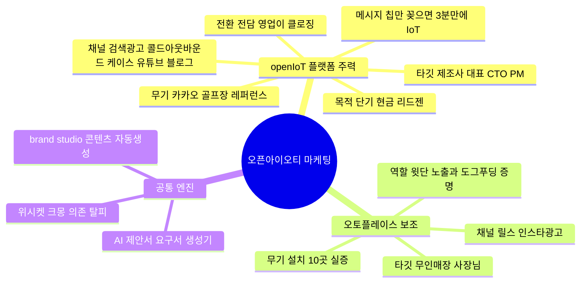
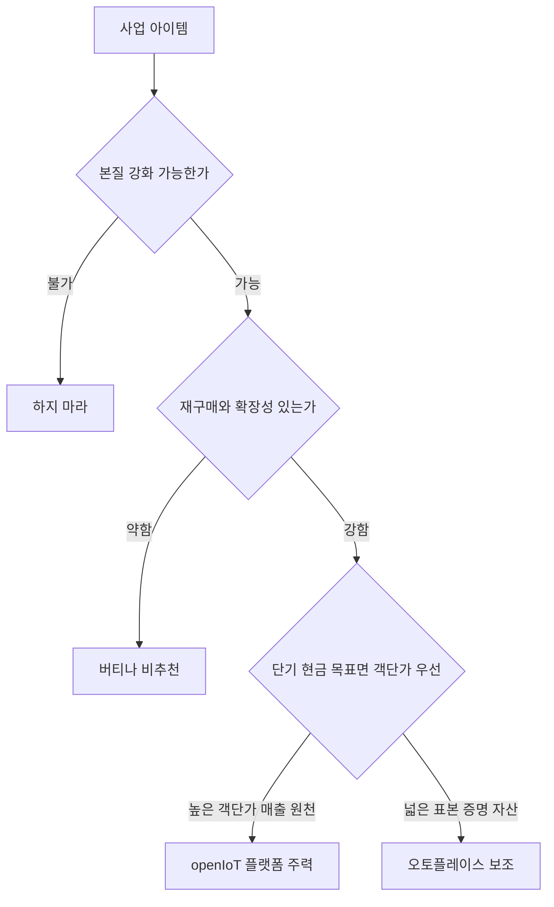
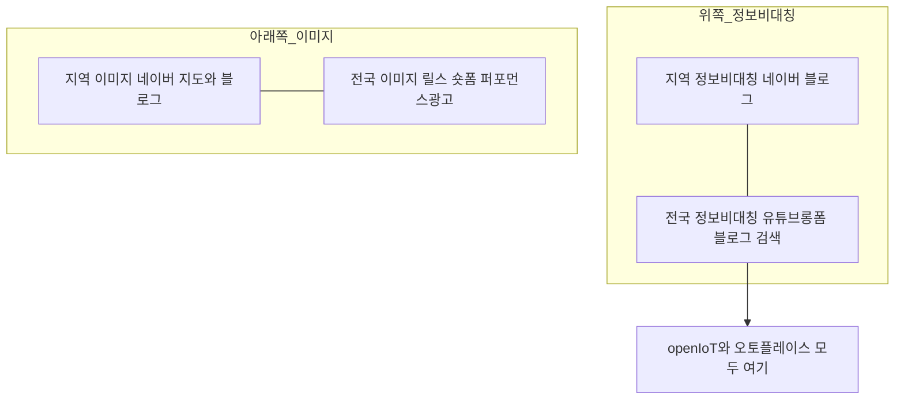
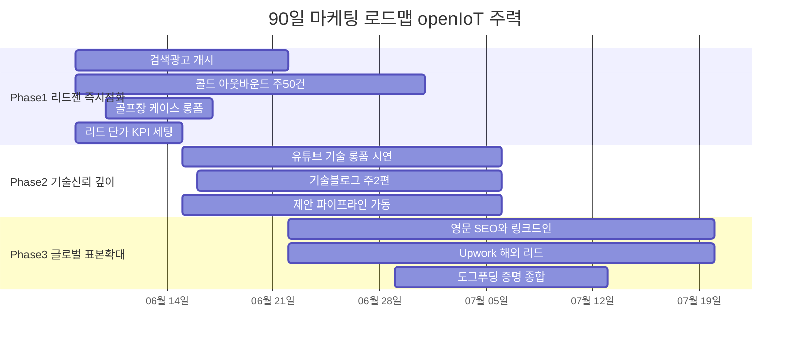

# 오픈아이오티(OpenIoT) 마케팅 전략 & 실행 계획

> 근거: `대본/이상한마케팅` 51편(자청·이상한마케팅) + `대본/글천개` 13편(매출·단골·퍼널) 플레이북 +
> `brand-studio/data/company-kb.md`(회사·제품 사실) + 2026-06-08 우선순위 의사결정.
> 작성일: 2026-06-07 · 개정: 2026-06-08 (우선순위 역전 + 글천개 인사이트 반영)
> 연결 문서: [콘텐츠 제작계획](오픈아이오티_콘텐츠제작계획.md) · [30일 캘린더](오픈아이오티_콘텐츠캘린더_30일.md) · [글천개 추가 인사이트](글천개_추가인사이트.md)

---

## 0. 핵심 결론 먼저

대본 전체를 관통하는 잣대.

1. **4사분면** — 도달범위(지역↔전국) × 정보비대칭(품질을 소비자가 아는가)으로 채널이 결정된다.
2. **본질 강화 가능성** — 상품을 내 손으로 계속 업그레이드할 수 있는 사업만 마케팅이 먹힌다.
3. **(글천개) 매출 3분해** — 매출 = 고객수 × 구매빈도 × 가격. 단기에 통제 가능한 유일한 레버는 **우리를 아는 의사결정자 수**.

### 2026-06-08 우선순위 결정

세 가지 사실로 비중을 확정했습니다.

| 확인 | 답 | 결론 |
|---|---|---|
| 현재 매출 주 원천 | **openIoT 개발·플랫폼** | 이미 돈 도는 곳에 집중 |
| 6개월 1순위 | **단기 현금흐름** | 객단가 큰 B2B 리드젠으로 빠른 현금 |
| B2B 영업 리소스 | **전담 영업 있음** | 리드를 만들면 영업이 닫는다 → 리드젠 중심 |

> **결론: openIoT 플랫폼 주력(약 60%) · 오토플레이스 보조(약 40%).**
> 오토플레이스는 ① 표본 넓은 윗단 노출 ② **우리 플랫폼으로 우리가 직접 서비스를 만들어 10곳에서 돌린다는 도그푸딩 증명**(openIoT B2B 최강 신뢰 자산)으로 재배치.



---

## 1. 사업 진단 — 마케팅 해도 되는 사업인가

대본의 **사업 판정 공식**으로 먼저 검증합니다. (분자가 클수록 유리)

```
판정 = (본질강화 + 재구매율 + 확장성) / (원가 + 재고 + 유통 + 경쟁강도)
```

| 항목 | openIoT 플랫폼 | 오토플레이스 |
|---|---|---|
| 본질 강화 가능 (최핵심) | 우수 — 플랫폼 펌웨어 지속개발 | 우수 — SaaS 지속 기능추가 |
| 재구매율 | 양호 — 유지보수 확장 계약 | 우수 — 월구독 구조적 재구매 |
| 원가 재고 유통 | 우수 — 낮음 | 우수 — 서버리스 거의 제로 |
| 확장성 | 우수 — 글로벌 다산업 | 우수 — 다점포 해외 |
| 정보 비대칭 | 매우 강함 | 강함 |
| 객단가 | **높음(프로젝트·계약)** | 낮음(월구독) |

**판정: 둘 다 대본 기준 최상급(2.0 이상) 사업.** 단, 6개월 현금 목표에선 **객단가 높고 매출이 이미 도는 openIoT**가 우선.



---

## 2. 4사분면 분류

대본의 4사분면 매트릭스에 두 제품을 올린 결과.



> 가로축은 왼쪽 지역에서 오른쪽 전국, 세로축은 위쪽 정보비대칭에서 아래쪽 이미지. 두 제품 모두 **전국 더하기 정보비대칭** 사분면.

- openIoT는 **정보비대칭이 극심** → 기술 신뢰 콘텐츠가 필수. 모텔이론대로 신뢰부터.
- 현재 **위시켓·크몽 의존**은 "남의 플랫폼에 갇혀 본질이 안 쌓이는 상태". 자사 인바운드 리드로 전환해야 객단가·전환율 개선(단기현금 + 전략 과제가 같은 방향).

---

## 3. 제품별 마케팅 전략

### A. openIoT 플랫폼 (주력) — 리드를 만들고 영업이 닫는다

제조사 대표·CTO는 이 회사가 진짜 IoT를 만들 수 있는지 모릅니다(극단적 정보비대칭). 대본은 이런 업종일수록 **전문 지식 콘텐츠로 신뢰를 먼저** 쌓으라고 합니다. 전담 영업이 있으니 마케팅의 임무는 **질 좋은 B2B 리드 공급**입니다.

적용 원칙 (이상한마케팅 + 글천개):
- **모텔 이론** — 첫 접촉에 외주 맡기라 하지 말 것. 기술 롱폼·블로그로 실력 증명 후 자연스러운 문의.
- **구체성은 신뢰** — 카카오 골프장 케이스가 최강 무기. → [05 골프장 케이스 롱폼](05_openIoT_골프장케이스_유튜브롱폼.md)
- **제안서 = 비판 → 수치적 대안** — AI 요구서 생성기로 개인화. → [06 콜드 아웃리치 템플릿](06_openIoT_콜드아웃리치_템플릿.md)
- **(글천개) 상황 타깃** — 페르소나("제조업 사장님")가 아니라 **구매 트리거 상황**(신규 라인 증설·외주 잠수·규제 대응·가동률 악화)에 메시지를 맞춘다.
- **(글천개) 전환 = 믿음 × 구조** — 레퍼런스 수치(다운타임·운영비 절감) + 단일 다음 버튼(PoC 신청). 둘 중 하나만 없어도 전환은 0.
- **(글천개) 선별 초대 퍼널** — 무료 진단 → 유상 PoC → 본계약. 진단은 예산 단계 기업만 선별.
- **(글천개) 손실·비교 프레임** — "절감 X원"이 아니라 "매월 새는 손실 X원" + "경쟁사는 이미 줄였는데 귀사는 구식".

주력 채널: **검색광고(의도 높은 수요) + 콜드 아웃바운드(영업 직접 공급) + 케이스 스터디 + 유튜브 기술 롱폼 + 기술 블로그 SEO(국문·영문)**.

### B. 오토플레이스 (보조) — 표본 노출 + 도그푸딩 증명

직접판매가 되는 제품이라 self-serve 전환은 유지하되, 핵심 역할은 **윗단 노출과 플랫폼 증명**입니다.

적용 원칙:
- **편리함 금지, 돈 먼저** — "편리한 IoT는 필요없다, 돈 벌어주는 IoT".
- **숫자의 원칙 + 의심 격파** — 설치 10곳, 비용 수천만원→수십만원, 정산 3일→클릭 한 번. (기존 [04 광고·랜딩 카피](04_광고_랜딩_카피.md) 활용)
- **(글천개) 메타 증명** — "우리 플랫폼으로 만든 무인매장이 10곳에서 돌아간다"를 openIoT B2B 영업 자료로 재활용.

주력 채널: 릴스(넓은 표본 노출) + 인스타 self-serve 광고(저예산 유지).

---

## 4. 전환 설계 — openIoT 리드젠 퍼널 (진단 우선)

글천개의 **3단계 매출 진단**: 막힌 곳은 트래픽·이탈·전환 셋 중 하나. 세 군데를 동시에 손대면 6개월을 날린다 → **막힌 한 곳만 진단해 그것만 뚫는다.**


| 구간 | openIoT 매핑 | 막힘 신호 | 처방 |
|---|---|---|---|
| 트래픽 | 인바운드 리드·도달 | 월 신규 문의 1~2건 미만 | 검색광고·콜드·케이스로 인지 노출 |
| 이탈 | 제안서·데모에서 이탈 | 미팅은 잡히나 검토 중 사라짐 | 3단 압축 + 수치 사례 |
| 전환 | 미팅 후 계약 | 다 보고도 타벤더 선정 | 레퍼런스 수치 + 단일 다음 버튼 |

---

## 5. 90일 실행 계획 (openIoT 주력)

[30일 캘린더](오픈아이오티_콘텐츠캘린더_30일.md)와 동일한 우선순위. 단기 현금이라 **바닥퍼널(검색광고·콜드·케이스)을 1주차부터** 켠다.



### Phase 1 (0–30일) — openIoT 리드젠 즉시 점화
| 할 일 | 근거 |
|---|---|
| 네이버·구글 검색광고(IoT 개발·ESP32·BLE 키워드) 개시 | 정보비대칭 + 의도 높은 수요 |
| 콜드 아웃바운드 주 50건(AI 요구서 생성기 개인화) → 전담 영업 핸드오프 | 제안서=수치적 대안 / 영업 직접 공급 |
| 카카오 골프장 케이스 롱폼 + 랜딩에 단일 CTA(무료 진단) | 구체성은 신뢰 / 믿음×구조 |
| 오토플레이스 릴스로 표본 노출 유지 | 윗단 도달 + 도그푸딩 증명 |
| KPI: 인지된 의사결정자 수, 리드 단가, 미팅 전환 세팅 | 매출 3분해 / 진단 |

### Phase 2 (30–60일) — 기술 신뢰 깊이
| 할 일 | 근거 |
|---|---|
| 유튜브 기술 롱폼(칩 연결 3분 시연 등) | 4단계 공식 / 모텔 이론 |
| 기술 블로그 SEO 주 2편(ESP32·BLE·OTA·Matter·서버리스) | 표본 이론 / 3단계 실전 정보 |
| 제안 파이프라인 가동(레퍼런스 수치 + 단일 버튼) | 전환=믿음×구조 |
| ICP 스크리닝(라이트형 집중, 헤비·진상 거르기) | 레파토리/라이트 유저 / 고객 자격 필터 |

### Phase 3 (60–90일) — 글로벌 표본 확대 + 종합
| 할 일 | 근거 |
|---|---|
| 영문 SEO·링크드인·Upwork로 해외 IoT 수요 유입 | 표본 확대 |
| 검증된 콜드 메시지·키워드에 예산 집중 | 변형 후 검증 집중 |
| 오토플레이스 도그푸딩 증명 콘텐츠 전면 활용 | 메타 증명 |
| 위시켓 크몽 의존도 낮추고 자사 유입 비중 측정 | 남의 플랫폼 탈피 |

---

## 6. 자사 도구로 도그푸딩 — 직원 0명 마케팅

대본 [이제 직원 0명으로 마케팅]의 핵심은 AI로 콘텐츠 생산을 자동화하는 것. OpenIoT는 이미 도구를 직접 만들었음.

- **brand-studio** — 대본 지식베이스(이상한마케팅 51편 + 글천개 13편) + 회사 KB로 콘텐츠 자동생성. 사내 콘텐츠 공장으로 매일 가동.
- **AI 프로젝트 요구서 생성기** — 콜드 아웃리치·제안서 개인화 자동화. → [06 콜드 아웃리치 템플릿](06_openIoT_콜드아웃리치_템플릿.md)의 마스터 템플릿이 이 도구 출력값을 받도록 설계됨.

> 메타 스토리: "우리는 우리 도구로 우리 마케팅을 한다"는 사실 자체가 openIoT 플랫폼의 기술력 증명 콘텐츠.

---

## 7. 측정 KPI — 리드·현금 중심 (글천개 진단 반영)

조회수·도달 같은 허영지표가 아니라 **현금에 직결되는 지표**로 정렬.

- **openIoT 플랫폼(주력)**: 인지된 의사결정자 수 → 리드 단가 → 미팅 전환 → 무료 진단 → 유상 PoC → 본계약 / 자사유입 비중(위시켓 탈피 척도)
- **진단 지표**: 막힌 구간(트래픽·이탈·전환)을 매주 한 곳만 지정해 개선
- **오토플레이스(보조)**: 릴스 도달·저장 → self-serve 무료가입 → 도그푸딩 콘텐츠 영업 재활용 횟수
- **현금 방어**: 고정비 동결, 초기 일회성 지출 최소화(글천개 16억 교훈)

---

## 8. 글천개 13편에서 새로 반영한 것

전체 인사이트는 [글천개 추가 인사이트](글천개_추가인사이트.md) 참고. 전략에 반영한 핵심:

| 인사이트 | 전략 반영 |
|---|---|
| 매출 3분해 | KPI를 "인지된 의사결정자 수" 중심으로 재정의 |
| 3단계 진단(트래픽·이탈·전환) | 한 번에 하나만 뚫는 퍼널 설계(섹션 4) |
| 상황 타깃 | 콜드·콘텐츠를 구매 트리거 상황 기준으로 |
| 전환=믿음×구조 | 레퍼런스 수치 + 단일 CTA 버튼 표준화 |
| 손실·비교 프레임 | "매월 새는 손실" + "경쟁사는 이미" 카피 |
| 선별 초대 + 회수 한 쌍 | 무료 진단→PoC→본계약, 리드자석에 회수 구조 |
| 라이트 유저·고객 자격 필터 | ICP 스크리닝(헤비·진상 거르기) |
| 현금 방어(16억 교훈) | 고정비 동결·초기 과지출 금지 |

---

## 한 장 요약

| 질문 | 판단 |
|---|---|
| 우선순위는 | **openIoT 주력(60%) · 오토플레이스 보조(40%)** — 매출 원천·단기현금·전담영업 |
| 어떤 사분면인가 | 둘 다 전국 + 정보비대칭 |
| 마케팅의 임무 | B2B 리드 공급 → 전담 영업이 클로징 |
| openIoT 핵심 | 검색광고·콜드·케이스로 1주차부터 바닥퍼널, 모텔이론으로 신뢰 |
| 오토플레이스 핵심 | 표본 노출 + 도그푸딩 증명으로 재배치 |
| 글천개가 더한 것 | 상황 타깃·진단 우선·손실 프레임·선별 초대·현금 방어 |
| 최대 무기 | 카카오 골프장 레퍼런스 + 도그푸딩(10곳 실증) + AI 제안 자동화 |
| 탈피 과제 | 위시켓 크몽 의존을 자사 인바운드 리드로 전환 |
