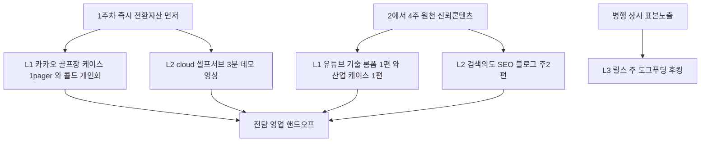
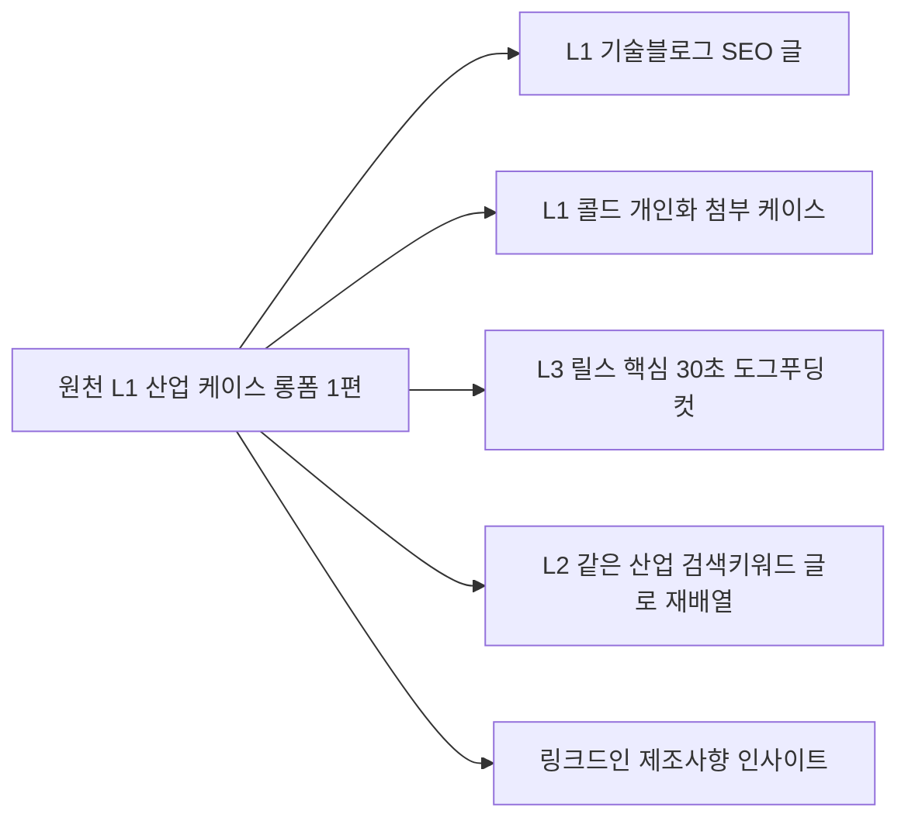

# 오픈아이오티 콘텐츠 전략 — 3라인 × 마케팅 KB 조합 설계

> 무엇을(주제·우선순위)을 정하는 문서. **어떻게 만드나(SOP)**는 [콘텐츠 제작계획](오픈아이오티_콘텐츠제작계획.md), **왜(전략)**는 [마케팅 전략](오픈아이오티_마케팅전략.md), **회사 사실**은 [회사 정의](오픈아이오티_회사정의.md)를 본다.
> 조합 근거: 회사정의 3라인 + 이상한마케팅 51편 + [글천개 13편 인사이트](글천개_추가인사이트.md).
> 작성일: 2026-06-13.

---

## 0. 분석 — 무엇이 달라졌나 (기존 계획의 공백)

기존 콘텐츠 계획은 "오토플레이스 vs openIoT" 2분할이었다. 회사정의가 **3라인**으로 정교해지면서 콘텐츠도 3개의 다른 게임으로 쪼개야 한다. 라인마다 **정보비대칭·객단가·구매행동**이 달라 통하는 콘텐츠가 다르기 때문.

| 라인 | 고객이 콘텐츠에서 확인하려는 것 | 그래서 필요한 콘텐츠 본질 | KB 핵심 무기 |
|---|---|---|---|
| 1 풀커스텀(HW+SW) | "진짜 칩부터 만들 실력이 있나?" | **신뢰 증명**(케이스·기술 깊이) | 사례=매출 · 3단계 실전정보 · 모텔이론 |
| 2 기성+SW | "내 문제를 빨리·싸게 풀어주나?" | **즉시수요 응답**(검색의도 how-to) | 상황 타깃 · 손실/비교 프레임 · 표본 |
| 3 자체솔루션 | "이게 실제로 돌아가긴 하나?" | **도그푸딩 증명**(우리가 직접 운영) | 메타 증명 · 숫자 원칙 · 의심 격파 |

> 추가 발견(회사정의): **cloud.openiot.app 셀프서브 콘솔이 이미 존재.** → "0원 3분 시작"을 말로만 하지 말고 **실제 가입→첫 기기 연동 데모 콘텐츠**로 만들 수 있다(라인 2의 강력한 전환 자산). 위시켓 탈피의 자사 유입 종착지이기도 함.

---

## 1. 콘텐츠 매트릭스 (라인 × 퍼널 × 콘텐츠)

글천개 3단계 진단(트래픽-이탈-전환)을 가로축으로, 3라인을 세로축으로 깐다.

| | 트래픽(인지) | 이탈(검토 유지) | 전환(클로징) |
|---|---|---|---|
| **L1 풀커스텀** | 유튜브 기술 롱폼, 링크드인 기술 인사이트 | 산업별 Before/After 케이스, 기술 블로그 3단계 | 카카오 골프장 케이스 PDF, 콜드 개인화 제안 |
| **L2 기성+SW** | 검색 SEO(연동·앱개발 키워드), 검색광고 | how-to 블로그, cloud 셀프서브 데모 영상 | 견적 계산기, 무료 진단→유상 PoC |
| **L3 자체솔루션** | 릴스/쇼츠(넓은 표본), 인스타 | 도입 후기·도그푸딩 수치 콘텐츠 | 셀프서브 무료가입, 영업 재활용 레퍼런스 |

각 칸의 제작 틀(릴스 4공식·롱폼 4단계·블로그 마인드리딩 등)은 기존 [콘텐츠 제작계획 §3](오픈아이오티_콘텐츠제작계획.md)을 그대로 재사용한다. 이 문서는 **칸에 들어갈 실제 주제**를 채운다.

---

## 2. 라인별 콘텐츠 주제 은행 (바로 제작 투입용)

### L1 풀커스텀 — 신뢰 증명 (객단가 최고 · 단기현금 1순위)

핵심 원리: **사례=매출**(글천개 ⑧) + **3단계 실전정보**(글천개 ⑦, 엔지니어가 "기본이라" 넘기는 게 99%가 모르는 노하우) + **모텔이론**(첫 접촉에 영업 금지, 실력부터).

원천 콘텐츠(유튜브 롱폼 / 기술 블로그):
- "카카오 골프장에 IoT 납품한 회사가 말하는, 외주 맡기기 전 꼭 확인할 3가지" (권위인용 + 3단계)
- "ESP32로 양산까지 갔을 때 90%가 막히는 펌웨어 한 가지" (3단계 실전정보)
- "OTA 펌웨어 배포, 잘못하면 전 기기 벽돌 되는 이유" (손실 프레임 + 기술 깊이)
- "수면 디바이스(TEDIMEDI)를 IoT로 만든 과정 전체 공개" (Before/After 케이스)
- 산업별 케이스 시리즈: 헬스케어·산업안전·농업환경 각 1편 (포트폴리오 18종에서 추출)

전환 자산:
- 카카오 골프장 케이스 1-pager PDF (영업이 그대로 들고 감)
- 콜드 아웃리치: 상황 타깃 첫 줄 + "왜 이 가격인가" 1줄 + 손실/비교 프레임 (이미 [06 템플릿](06_openIoT_콜드아웃리치_템플릿.md))

### L2 기성+SW — 즉시수요 응답 (리드 볼륨 최다)

핵심 원리: **상황 타깃**(글천개 ④, "~상황이 터졌을 때 이렇게") + **검색의도 직격** + **셀프서브 데모**.

원천 콘텐츠(SEO 블로그 / 검색광고 / 데모 영상):
- "SmartThings 연동 앱, 직접 만들지 말고 이렇게 (개발 기간·비용 비교)" (비교 프레임)
- "헤이홈 기기로 무인 매장 만들기 — 하드웨어는 사고 SW만 붙이는 법"
- "BLE 앱 개발 외주 견적 받기 전에 알아야 할 것" (검색의도 + 게이트키퍼)
- "Matter 지원 제품, 앱 없이 시작 못 하는 이유와 해결" (상황 타깃)
- cloud.openiot.app 셀프서브 데모: "가입부터 첫 기기 대시보드 연동까지 3분" (화면녹화)

전환 자산:
- 인터랙티브 견적/ROI 계산기 (회수 구조 = 연락처 수집과 한 쌍, 글천개 ⑪)
- 무료 진단 → 유상 PoC 선별 초대 퍼널 (글천개 ⑩)

### L3 자체솔루션 — 도그푸딩 증명 (표본 노출 + L1·L2 신뢰 자산)

핵심 원리: **메타 증명**(글천개 ⑫) + **숫자 원칙 + 의심 격파** + **넓은 표본 첫 장면**.

원천 콘텐츠(릴스/쇼츠 / 셀프서브):
- "우리 플랫폼으로 우리가 직접 무인매장 10곳 돌립니다" (도그푸딩 선언 — L1/L2 영업에도 재활용)
- "토요일 밤 11시, 도어락 비번 또 알려주셨죠?" (오토플레이스 페인 후킹)
- "정산 3일 → 클릭 한 번" / "운영비 수천만원 → 수십만원" (숫자·의심격파)
- 방온도·오픈플러그·오픈노트 각 솔루션 30초 작동 데모
- 도그푸딩 수치 공개: 자체 운영 매장의 다운타임·운영비 Before/After

---

## 3. 우선순위 — 단기현금 6개월 기준 (무엇부터)

매출 3분해(통제 가능한 레버 = 인지된 의사결정자 수) + 진단(막힌 한 곳만) 원칙으로 정렬.

| 순위 | 콘텐츠 | 라인 | 근거 |
|---|---|---|---|
| 1 | 카카오 골프장 케이스 1-pager + 콜드 개인화 | L1 | 사례=매출, 전환 직결, 영업 즉시 사용 |
| 2 | cloud 셀프서브 "3분 연동" 데모 영상 | L2 | 즉시수요 전환, 자사유입 증명, 위시켓 탈피 |
| 3 | 유튜브 기술 롱폼 1편(골프장 권위형) | L1 | 신뢰 원천, 멀티유즈 원소스 |
| 4 | 검색의도 SEO 블로그 주 2편(연동·앱개발) | L2 | 리드 볼륨, 트래픽 막힘 해소 |
| 5 | 릴스 도그푸딩 후킹(상시) | L3 | 넓은 표본 인지, L1/L2 신뢰 보강 |

> 진단 규칙: 지금 막힌 곳이 트래픽이면 1·4·5, 이탈이면 2·3, 전환이면 1번에 자원 몰빵. **세 곳 동시 착수 금지.**

---

## 4. 원소스 멀티유즈 — 라인 교차 재활용

3라인이 따로 놀지 않게, 하나의 원천을 라인 간에 돌린다(회사정의의 "L3가 L1·L2를 증명한다" 구조를 콘텐츠로 실현).

- L3 도그푸딩 수치는 L1 콜드메일·L2 견적 페이지의 **신뢰 근거**로 그대로 인용.
- 18종 포트폴리오는 산업별 케이스 콘텐츠의 **고갈 안 되는 주제 광산**.

---

## 5. 품질 가드 (배포 전 — KB 필수)

기존 [제작계획 §7 체크리스트](오픈아이오티_콘텐츠제작계획.md) + 3라인 추가 항목:

- [ ] 이 콘텐츠가 **어느 라인·어느 퍼널 칸**인지 명확한가
- [ ] L1이면 **구체 수치 케이스/3단계 정보**가 있는가 (스펙 나열 = 0점)
- [ ] L2면 **검색 의도/구매 상황**을 정확히 때리는가 (상황 타깃)
- [ ] L3면 **도그푸딩 실증 수치**인가 (주장만이면 반려)
- [ ] 손실/비교 프레임으로 긴급성을 만들었는가
- [ ] 전환 콘텐츠에 **단일 CTA + 회수 구조**가 한 쌍으로 있는가
- [ ] 없는 기능·고객사·수치 날조 없는가 ([company-kb](../brand-studio/data/company-kb.md) 대조)

---

## 한 장 요약

| 질문 | 답 |
|---|---|
| 콘텐츠를 왜 3개로 쪼개나 | 라인마다 정보비대칭·객단가·구매행동이 달라 통하는 콘텐츠가 다름 |
| L1 핵심 | 신뢰 증명 = 케이스(사례=매출) + 3단계 실전정보, 객단가 최고라 1순위 |
| L2 핵심 | 즉시수요 = 검색의도 how-to + cloud 셀프서브 데모, 리드 볼륨 |
| L3 핵심 | 도그푸딩 증명 = 우리가 직접 운영하는 수치, L1/L2 신뢰 보강 |
| 무엇부터 | 1 골프장 케이스+콜드 → 2 셀프서브 데모 → 3 롱폼 → 4 SEO → 5 릴스 |
| 신규 자산 | cloud.openiot.app 셀프서브 "3분 연동" 데모 (자사유입·전환·위시켓탈피 1석3조) |
| 묶는 원리 | 하나의 케이스를 L1·L2·L3로 돌려 "L3가 L1·L2를 증명"을 콘텐츠로 실현 |
