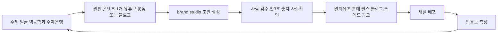
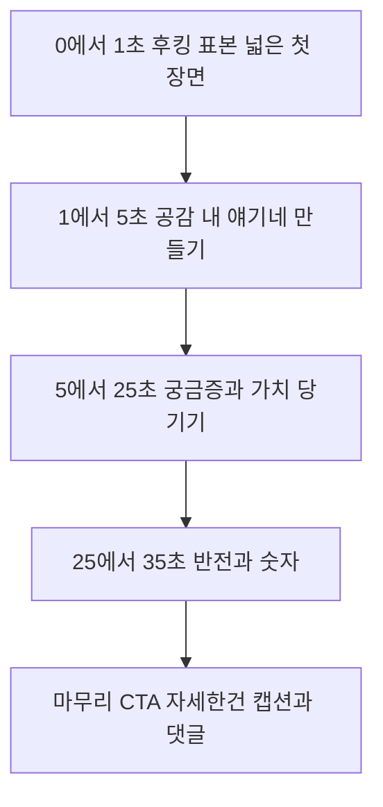
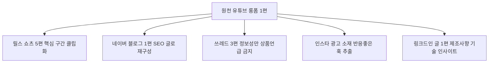

# 오픈아이오티(OpenIoT) 콘텐츠 제작 계획

> 짝꿍 문서: `오픈아이오티_마케팅전략.md`(무엇을 왜). 이 문서는 **어떻게 만들지(How)**.
> 근거: `대본/` 51편 + `brand-studio` 콘텐츠 자동생성 엔진 + 기존 샘플 4종.
> 작성일: 2026-06-08

---

## 0. 제작 철학 3줄

1. **창작하지 말고 역공학하라** — 잘 터진 포맷을 먼저 모방(피카소 이론), 내용만 우리 것으로.
2. **하나 만들어 열 개로 쪼개라** — 유튜브 롱폼 1편이 릴스 5편 + 블로그 1편 + 쓰레드 3편의 원천.
3. **AI로 양산, 사람은 후킹과 사실확인만** — brand-studio가 초안, 사람은 첫 3초와 숫자 검증.

---

## 1. 콘텐츠 공장 파이프라인

매주 같은 흐름을 반복하는 컨베이어벨트로 운영합니다.

> 핵심: A에서 G까지 한 바퀴가 1주. 매주 원천 1개를 만들고 그걸 잘게 쪼개 전 채널을 채웁니다.

---

## 2. 1단계 — 주제 발굴 (창작 금지)

대본의 **유튜브 역공학 + 뷰트랩 3단계**를 그대로 적용합니다.

### 역공학 절차
1. 우리 카테고리 키워드로 유튜브와 인스타 검색 (무인매장 자동화, 파티룸 창업, IoT 개발, ESP32, 스마트팩토리 등)
2. 필터를 조회수순 길이 4분에서 20분 전체기간으로 설정
3. 상위 콘텐츠의 제목과 썸네일 패턴(숫자 해결 시간단위)을 추출 → 우리 식으로 변형
4. 완전 카피 금지, 반드시 변형. 포맷만 베끼고 내용은 우리 것.

### 잘 통하는 제목 포맷 (우리 버전으로 변형해 사용)
- 숫자형: 무인매장 사장님이 모르는 5가지, 정산 3일을 클릭 한 번으로
- 손실위협형: 이거 모르고 무인매장 차리면 첫 달에 수백만원 날린다
- 권위인용형: 카카오에 IoT 납품한 회사가 알려주는 자동화의 정석
- 비포애프터형: 직접 운영하던 사장 vs 시스템에 맡긴 사장
- 언매칭형: 무인매장인데 사장님이 24시간 대기 중이라고요

### 주제 은행 (계속 채워가는 표)
| 제품 | 페인포인트 주제 | 교육 주제 | 신뢰 주제 |
|---|---|---|---|
| 오토플레이스 | 심야 도어락 응대, 중복예약, 퇴실후 냉난방 낭비, 월말정산 | 무인매장 창업 체크리스트, 예약채널 통합법 | 설치 10곳 후기, 비용 비교 |
| openIoT 플랫폼 | SW팀 없이 IoT 개발, 비싼 외주, 긴 개발기간 | 칩 연결 3분 데모, OTA 펌웨어 배포법 | 카카오 골프장 케이스 |

---

## 3. 2단계 — 채널별 제작 템플릿

각 포맷마다 대본 공식을 고정 틀로 박아두고 내용만 갈아끼웁니다.

### 3-1. 릴스 / 쇼츠 (가장 많이 찍어내는 포맷)

**고정 구조 (숏폼 4공식 + 첫5초 법칙)**

제작 규칙:
- 첫 장면 표본 최대화. 좁은 표현(파티룸 IoT 제어) 대신 넓은 표현(무인매장 사장님이라면 공감).
- 명령형 카피. 뭐뭐하지 말고 이거 하세요 형태가 서술형보다 강함.
- 한 장면 3초 이하, 박자에 맞춰 전환. 썸네일 카피 15자 이내.
- 인스타 데드존(상단과 하단) 텍스트 금지.
- 언매칭 활용. 무인매장인데 사장님만 24시간 대기 같은 상식 뒤집기.
- 참고: 기존 `01_인스타_릴스_쇼츠_스크립트.md` 3편이 이 틀의 완성 예시.

### 3-2. 유튜브 롱폼 (신뢰 자산의 원천)

**고정 구조 (조회수 4단계 공식)**

| 구간 | 공식 단계 | 우리 적용 |
|---|---|---|
| 0에서 20초 | 후킹 | 토요일 밤 11시 또 도어락 비번 알려주셨죠 |
| 이어서 | 가치 입증 | 카카오 골프장 납품, 설치 10곳 이상 |
| 이어서 | 라포르 | 우리도 직접 매장 운영하며 같은 고통을 겪었다 |
| 이어서 | 도파민 | 예약 1건에 자동으로 벌어지는 6가지 |
| 본문 | 문제 나열과 해결 | 무인운영 4대 문제 → 6단계 자동화 시연 |
| 마무리 | CTA | 신뢰 형성 후에만 무료 시작 안내 |

제작 규칙:
- 후킹은 반드시 영상 안에. 가치입증은 썸네일에 박으면 본문에서 축약 가능.
- 전문용어는 한두 개만 전략적으로(권위감). 너무 많으면 역효과.
- 초반 유머 한 번으로 시청 지속률 상승.
- 참고: 기존 `02_유튜브_롱폼_대본.md`가 완성 예시.

### 3-3. 네이버 블로그 / SEO (정보비대칭 해소)

**고정 구조 (마인드리딩 + 가치입증 표준 구조)**
1. 마인드리딩 도입 — 독자 고민 2가지를 먼저 맞혀 공감
2. 가치 입증 — 연수 판매량 비포애프터를 숫자로
3. 구체적 증거 — 후기 사례 수치(반박 불가 형태)
4. CTA — 신뢰 형성 전에는 연락처 금지

제작 규칙:
- 추상어 절대 금지(압도적 뛰어난 최고의). 대본에서 자청이 유일하게 화내는 지점.
- 제목은 지식의 저주 피하기. 전문용어 나열 대신 손실위협이나 비포애프터로.
- 3대 입력값: 업체명 + 잡을 키워드 + 셀링포인트(구체 수치 비교).
- openIoT는 기술 블로그도 운영. ESP32 BLE MQTT Matter OTA 주제로 국문과 영문 동시.
- 참고: 기존 `03_네이버_블로그_글.md`가 완성 예시.

### 3-4. 인스타 퍼포먼스 광고 (모텔이론 예외, 직접 판매)

**고정 흐름 (인스타 광고 스크립트)**
타깃 공감 후킹 → 고통 공감 → 라포르 → 숫자와 포지셔닝 → 반박 선제격파 → 경계심 해제(무료 강조) → 간접 클로징

제작 규칙:
- 본능 분석 + 반박 제거가 핵심. 살까 말까 망설일 지점을 미리 깨준다.
- 헤드라인 8개 풀은 이미 `04_광고_랜딩_카피.md`에 있음. 3개씩 묶어 AB테스트.
- 숫자 원칙 필수. 설치 10곳, 정산 3일을 클릭 한 번, 비용 수십만원.

---

## 4. 3단계 — 원소스 멀티유즈 (하나로 열 개)

매주 원천 1개에서 전 채널 분량을 뽑아냅니다. 이게 양산의 핵심.

분해 규칙:
- 릴스는 롱폼에서 가장 반응 좋은 30초를 잘라 첫5초 후킹만 새로 입힘.
- 쓰레드는 첫 줄에 숫자, 2에서 3줄로 궁금증만, 상품명 금지(똑똑한 층 대상).
- 블로그는 같은 내용을 검색 키워드 중심으로 재배열.

---

## 5. 주간 콘텐츠 캘린더 (반복 루틴)

| 요일 | 작업 | 산출물 |
|---|---|---|
| 월 | 주제 발굴(역공학) + 원천 기획 | 이번주 주제 1개 확정 |
| 화 | brand-studio로 원천 롱폼 또는 블로그 초안 | 원천 초안 1개 |
| 수 | 사람 검수(첫3초 숫자 사실확인) + 촬영 또는 녹화 | 원천 완성본 |
| 목 | 멀티유즈 분해(릴스 블로그 쓰레드 광고) | 릴스 5 블로그 1 쓰레드 3 |
| 금 | 배포 + 인스타 광고 AB 갱신 | 전 채널 발행 |
| 상시 | 반응도 대시보드 확인 → 다음주 주제 반영 | KPI 로그 |

주간 목표 산출량: 릴스 5편, 롱폼 1편, 블로그 1에서 2편, 쓰레드 3편, 광고 소재 3종.

---

## 6. brand-studio 실전 운용 SOP

회사가 직접 만든 도구를 사내 콘텐츠 공장으로 매일 가동(대본의 직원 0명 마케팅).

입력 3종 세트(생성 품질의 80퍼센트 결정):
1. 브랜드와 제품 정보 — 제품 선택(오토플레이스 또는 openIoT)
2. 4사분면과 톤 — 전국 정보비대칭, 톤은 돈 중심 또는 기술 신뢰
3. 셀링포인트 — 반드시 구체 수치(설치 10곳, 비용 수십만원, 정산 클릭 한 번)

운용 규칙:
- 프롬프트 6공식 적용. 역할 부여, 목표, 형식, 예시(기존 샘플 4종), 깊은 사고, 동기부여.
- 황당한 전략 2개도 같이 요청 → 10개 중 1에서 2개 건짐.
- 생성물은 초안. 사람이 첫3초 후킹과 숫자만 손보면 완성.
- 절대 금지: 없는 기능과 고객사 날조, 효과 과장 단정, 추상어.

---

## 7. 품질 체크리스트 (배포 전 필수)

대본이 반복 강조한 하지 말 것 모음. 하나라도 걸리면 반려.

- [ ] 첫 1에서 2초에 후킹이 있는가 (없으면 즉시 이탈)
- [ ] 추상어를 썼는가 (압도적 뛰어난 최고의 → 즉시 삭제)
- [ ] 구체적 숫자가 있는가 (잘한다는 0점)
- [ ] 첫 장면 표본이 충분히 넓은가 (좁으면 조회수 박살)
- [ ] 신뢰 형성 전에 CTA나 계좌부터 들이밀지 않았는가 (모텔이론)
- [ ] 없는 기능이나 수치를 날조하지 않았는가
- [ ] 의심 격파가 되어있는가 (가격 호환 데이터이전 진짜자동)

---

## 8. 30일 콘텐츠 생산 목표

| 채널 | 30일 목표 | 비고 |
|---|---|---|
| 릴스 쇼츠 | 20편 이상 | 주 5편, 오토플레이스 위주 |
| 유튜브 롱폼 | 4편 | 오토플레이스 2, openIoT 2(골프장 케이스 포함) |
| 네이버 블로그 | 8편 | 정보비대칭 해소, 국문 |
| 기술 블로그 영문 | 4편 | openIoT 글로벌 표본 확대 |
| 쓰레드 | 12편 | 정보성, 상품 언급 금지 |
| 인스타 광고 소재 | 9종 | 3종씩 3회 AB 갱신 |

---

## 한 장 요약

| 단계 | 핵심 | 도구와 공식 |
|---|---|---|
| 주제 | 창작 금지 역공학 | 뷰트랩, 제목 포맷 변형 |
| 원천 | 롱폼 또는 블로그 1개 | 4단계 공식, 마인드리딩 구조 |
| 양산 | AI 초안 사람 검수 | brand-studio, 프롬프트 6공식 |
| 분해 | 하나로 열 개 | 롱폼에서 릴스 블로그 쓰레드 광고 |
| 배포 | 채널별 깊이 조절 | 릴스 가볍게 유튜브 깊게 |
| 측정 | 반응도 중심 | 시청지속 저장 공유 댓글 전환 |
