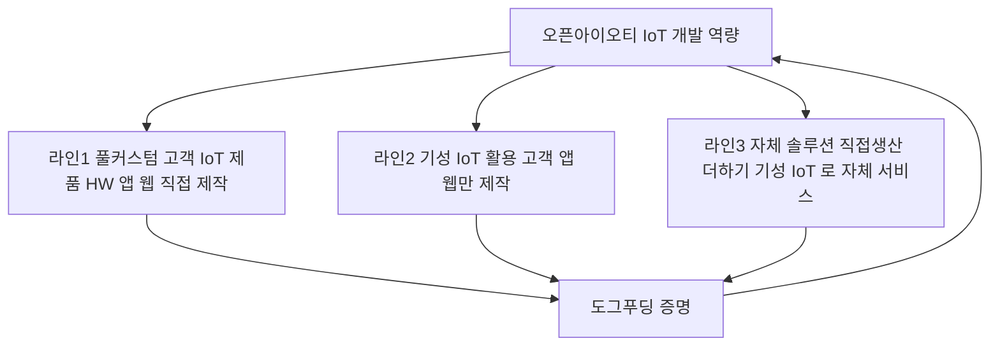

# 오픈아이오티(OpenIoT)는 무엇을 하는 회사인가

> 목적: 마케팅 전략의 **기반 사실 문서**. "우리가 뭘 하는 회사인지"를 한 곳에 확정한다.
> 근거: ① 대표 확정 사업영역 3분류(2026-06-13) ② 회사 사이트 openiot.app / autoplace.openiot.app(라이브 + 소스 코드) ③ GitHub 조직 openiot-dev · openiot-devteam 레포 전수 ④ 기존 회사 KB([company-kb.md](../brand-studio/data/company-kb.md)).
> 작성일: 2026-06-13. 민감자료(재무·세무·IR·개인정보)는 제외.

---

## 0. 한 문장 정의

> **오픈아이오티는 "디바이스 → 앱 → 클라우드 → AI 연동까지, IoT 서비스를 가장 빠르게 구축해주는 IoT 개발 전문업체"이며, 동시에 그 기술로 자체 솔루션(오토플레이스 등)을 직접 운영하는 회사다.**

사이트 메인 카피 그대로: **"IoT 개발 전문업체 — IoT 서비스를 가장 빠르게 구축하세요."** / **"표준을 넘어선 맞춤형 IoT"** / **"아이디어 하나로 서비스를 만들어 보세요."**

회사 정체성의 핵심은 **두 얼굴**이다:
1. **플랫폼·개발 제공자** — 남(고객사)의 IoT 서비스를 만들어 준다.
2. **서비스 운영자** — 그 도구로 우리가 직접 서비스를 만들어 돌린다(도그푸딩).

---

## 1. 사업 영역 — 3가지 (대표 확정)

이 3분류가 회사를 이해하는 **가장 정확한 뼈대**다. 객단가·정보비대칭·핵심 메시지가 서로 다르다.

### 라인 1 — 풀커스텀 (고객사 IoT 제품 HW + 앱/웹 직접 제작)
- **무엇**: 칩·펌웨어(HW)부터 앱·웹·클라우드까지 **처음부터 끝까지** 고객사 제품을 IoT로 만들어 준다.
- **증거(GitHub)**: `2xx-firmware` 다수(`205/206/204-firmware`, `201-firmware-aws-camera`), 칩별 펌웨어, FreeRTOS·ESP-IDF.
- **증거(사이트)**: "칩 제조사 최적화 펌웨어 제공 — ESP32, STM32, Nordic" / "하드웨어 설계·모바일앱·원격 업데이트(OTA)".
- **객단가**: 최고. **정보비대칭 극심**(고객이 진짜 만들 수 있는지 의심). → 신뢰 증명이 마케팅의 전부.

### 라인 2 — 기성 IoT 활용 (고객사 앱/웹만 제작)
- **무엇**: SmartThings·헤이홈(goqual)·Matter 등 **검증된 기성 IoT 하드웨어 위에 SW(앱/웹/연동)만** 빠르게 얹는다.
- **증거(GitHub)**: `999-test-smartthings-oauth`, `008-ble-template-*`, `008-wifi-template-*`, BLE/WIFI 템플릿 앱·웹뷰·서버 풀세트.
- **증거(파트너)**: 사이트 파트너 로고 = Espressif·Nordic·SiliconLabs·Raspberry Pi·**SmartThings·Hejhome**·AWS.
- **객단가**: 중간. 진입장벽 낮음 → **리드 볼륨 최다**. 메시지 = "처음부터 만들 필요 없이 더 싸고 빠르게".

### 라인 3 — 자체 솔루션 (직접생산 + 기성 IoT로 만든 오픈아이오티 자체 서비스)
- **무엇**: 위 두 역량을 합쳐 **우리 이름으로 SaaS 솔루션을 만들어 직접 운영**한다.
- **자체 솔루션 목록(사이트 solutions + GitHub)**:
  - **오토플레이스(autoplace)** — 무인 공간 운영 자동화. 예약→결제→IoT 제어→정산 풀 라이프사이클. **설치 10곳+**.
  - **오픈플러그(openplug)** — 스마트 플러그 제어 + 결제.
  - **방온도(bangondo)** — IoT 실내 온도 관리(바닥온도·기상청 연동 자동제어).
  - **오픈노트(opennote)** — 사이트 solutions에 정식 등재된 자체 솔루션.
  - **카킹(KARKING)** — BLE 기반 무인 주차/출입 앱.
- **객단가**: 낮음(구독). 그러나 **라인 1·2 영업의 살아있는 증거(도그푸딩)**라는 게 진짜 역할.

> **핵심 구조: 라인 3이 라인 1·2를 증명한다.** "직접 생산 IoT + 기성 IoT를 둘 다 써서 만든 솔루션이 실제 10곳에서 돈다" = 백 마디 광고보다 강한 신뢰 자산.

---

## 2. 무엇을 파는가 — 4대 핵심 역량 (사이트 SectionCore 그대로)

고객 입장에서 오픈아이오티가 제공하는 것은 IoT 구축의 4개 층 전부다.

| 층 | 사이트 카피 | 설명 |
|---|---|---|
| **앱·관리자** | "간편한 앱, 웹페이지 설정" | 개발자 없이도 모바일 앱 설정 + 대시보드에서 데이터 직접 제어 |
| **인프라** | "확장형 클라우드 인프라" | 기기·트래픽이 많아도 안정 동작 (AWS 서버리스) |
| **펌웨어** | "칩 제조사 최적화 펌웨어 제공" | ESP32·STM32·Nordic 등 칩별 최적 펌웨어 |
| **인공지능** | "AI와 IoT 기기 연결" | IoT 데이터를 AI가 실시간 분석·예측·제어, ML 없이 즉시 적용 |

핵심 제품 진입점: **cloud.openiot.app**(클라우드 콘솔 로그인/가입) · **admin.openiot.app**(관리자 대시보드). 즉 **"칩만 꽂으면 앱·대시보드 자동 연동, 0원 시작·3분 내 펌웨어/앱/대시보드"**가 셀프서브 형태로 존재.

---

## 3. 고객 / 레퍼런스 (사이트·포트폴리오 실데이터)

### 산업 분류 (사이트 "함께하는 고객사")
산업/안전 · 공간 플랫폼 · 물류/유통 · 스마트 라이프 · 헬스케어 · 농업/환경.

### 실제 고객사·레퍼런스
- **카카오 골프장 제어시스템** (openIoT 플랫폼 최강 레퍼런스)
- **TEDIMEDI** 수면 개선 디바이스(헬스케어) · **KARKING** 무인 주차 관리기(모빌리티) · **NOVA** AI 카메라 관리(스마트팜)
- **어반클래식·코이노니아·제이엔터** (오토플레이스 도입, 설치 10곳+)
- 기타 고객사 로고: HHI, DMsystem, Wordin, Whatsmatter, Seohong, UNIST, MUBIZ

### 포트폴리오 적용 제품군 (사이트 portfolio 18종)
수면개선 디바이스, 무인 주차기, AI 카메라, 스마트플러그, AI 오디오/비디오 스트리밍, 대화형 AI 하드웨어, 독서실 스마트 타이머, 스마트 조리도구, 무인매장 관리, 스마트 화재감지기, 전자저울, 반려동물 침대, 스마트 깔창, 수질 분석기, 스마트 안전모, 정밀조정 현미경 등 → **거의 모든 산업의 제품을 IoT화한 폭넓은 표본**.

---

## 4. 기술 역량 / 스택 (신뢰 근거 — CTO 설득용)

- **펌웨어**: FreeRTOS · ESP-IDF · 칩별(ESP32/STM32/Nordic) · OTA(FOTA)
- **통신/표준**: Matter · Zigbee · Thread · Wi-Fi · BLE
- **앱**: React Native(Expo) + WebView
- **웹**: Next.js 15/14 · React 19/18 · TypeScript · Tailwind · Zustand · TanStack Query · React Hook Form · Zod
- **서버(AWS 서버리스)**: Lambda(Python) · Serverless Framework v3 · S3 · DynamoDB(서울) · IoT Core · EventBridge Scheduler · API Gateway · Cognito · Amplify
- **보안**: Matter 인증 · TLS MQTT · X.509 · IAM 최소권한 · API 키 인증 · Cognito · 시간 기반 제어권한 제한
- **연동**: Toss Payments · Kakao Pay · SmartThings · Hejhome(goqual) · NCP AlimTalk(카카오 알림톡) · Webhook
- **파트너**: Espressif · Nordic · SiliconLabs · Raspberry Pi · SmartThings · AWS · Hejhome
- **사내 AI 도구(도그푸딩 증거)**: 'AI 프로젝트 요구서 생성기'(영업 제안 자동화), '마케팅 문구 자동 생성 AI', 사내 Claude Code 플러그인 모노리포.

---

## 5. 회사 미션 / 정체성

- **회사명**: 오픈아이오티(OpenIoT) · 대표 김동은
- **한 줄 정의**: "제품 하나 잘 만들기도 어려운데 서버·앱·웹·보안까지?! **제조업체를 위한 IoT 서비스**, 오픈아이오티."
- **미션/비전**: 사람–사물–인공지능을 연결해 더 많은 사람이 **'호모 하이퍼커넥투스'**가 되도록. IoT 자동화로 **세상의 비효율 제거**.
- **생존 전략**: *"우리가 만든 도구로 우리가 먼저 실험하며, 도구와 서비스 모두를 성장시킨다."* (= 도그푸딩)
- **연혁**: 2021 실험실 모듈 사업 시작→IoT 통합 시스템 전환(누적 주문 100건+) · 2024 IoT+서비스+AI 전환 · 2025 서버리스 양산 IoT 완성, 오토플레이스 실매장 도입.

---

## 6. 마케팅으로 넘어가는 다리 (이 문서가 시사하는 것)

| 사업 라인 | 정보비대칭 | 객단가 | 마케팅 임무 | 핵심 메시지 | 주력 채널 |
|---|---|---|---|---|---|
| 1 풀커스텀 | 극심 | 최고 | **신뢰 증명** → 고가 리드 | "칩부터 AI까지, 진짜 만든다" + 카카오 골프장 | 기술 롱폼·케이스·검색광고·콜드 |
| 2 기성+SW | 중간 | 중간 | **즉시수요 포획** → 리드 볼륨 | "처음부터 만들 필요 없이 더 싸고 빠르게" | 검색광고(연동·앱개발 키워드)·SEO |
| 3 자체솔루션 | 강함 | 낮음(구독) | **표본 노출 + 도그푸딩 증명** | "우리가 직접 만들어 10곳서 돌린다" | 릴스·셀프서브·증명 콘텐츠 |

- **공통 무기**: 카카오 골프장 레퍼런스 · 18종 포트폴리오(폭넓은 표본) · 도그푸딩 솔루션 · AI 제안 자동화.
- **공통 과제**: 위시켓·크몽 의존 → 자사 인바운드(cloud.openiot.app) 유입으로 전환(객단가·전환율 개선).
- **고객 선택지 제안 구조**: 풀커스텀(비쌈) ↔ 기성활용(쌈) ↔ 자체솔루션 그대로(즉시) 3단계 → 이탈 감소 + ICP 자동 분류.

> 다음 단계: 이 문서를 전제로 [오픈아이오티_마케팅전략.md](오픈아이오티_마케팅전략.md)를 3라인 구조로 갱신.

---

## 부록 — 출처
- 라이브: https://openiot.app · https://autoplace.openiot.app · cloud.openiot.app · admin.openiot.app
- GitHub: `openiot-dev`, `openiot-devteam` 조직(website, 008-openiot-cloud, 004-autoplace, 2xx-firmware, 008-ble/wifi-template-*, openplug, bangondo, karking, 202-admin 등)
- 웹사이트 소스: `openiot-website`(Hero·SectionCore·SectionReferences·portfolioData·solutionsData)
- 회사 KB: [brand-studio/data/company-kb.md](../brand-studio/data/company-kb.md)
- 사업영역 3분류: 대표 확정(2026-06-13)
